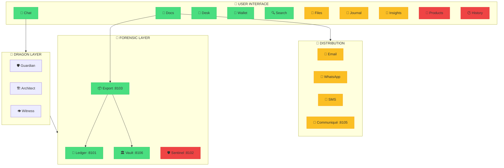
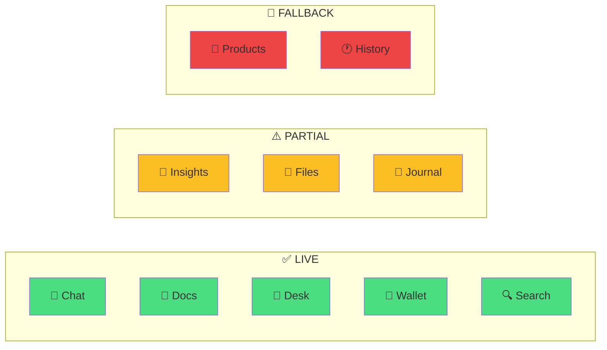
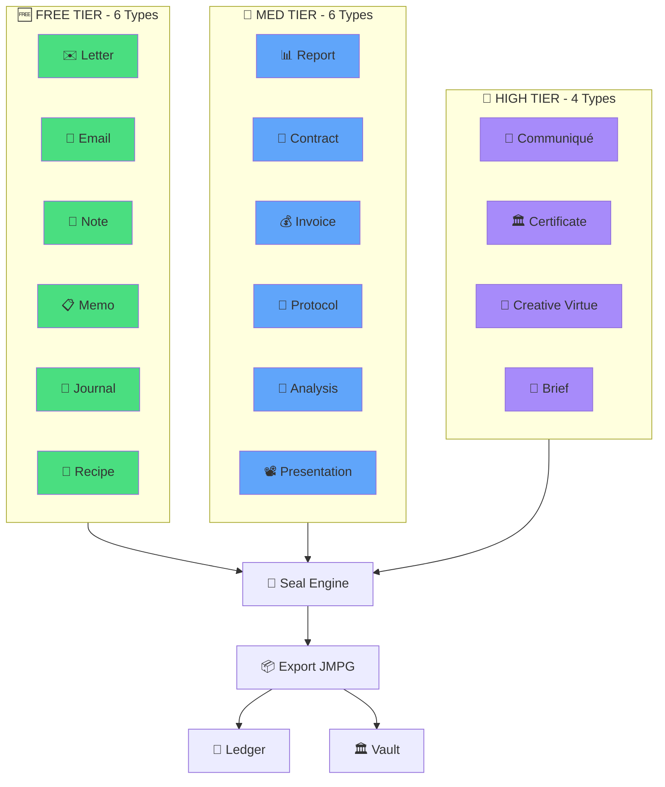
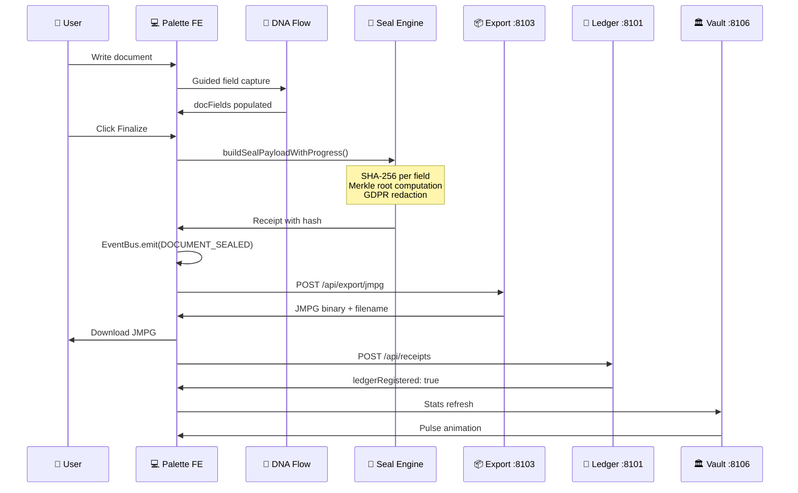
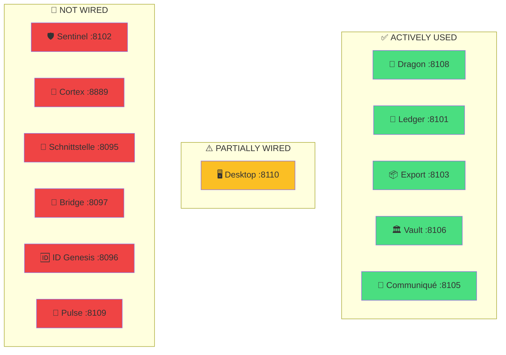
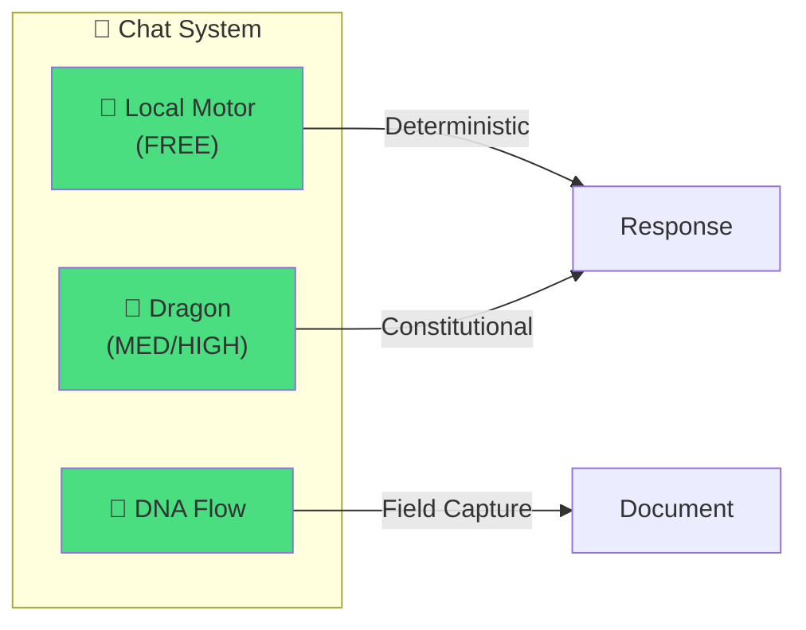
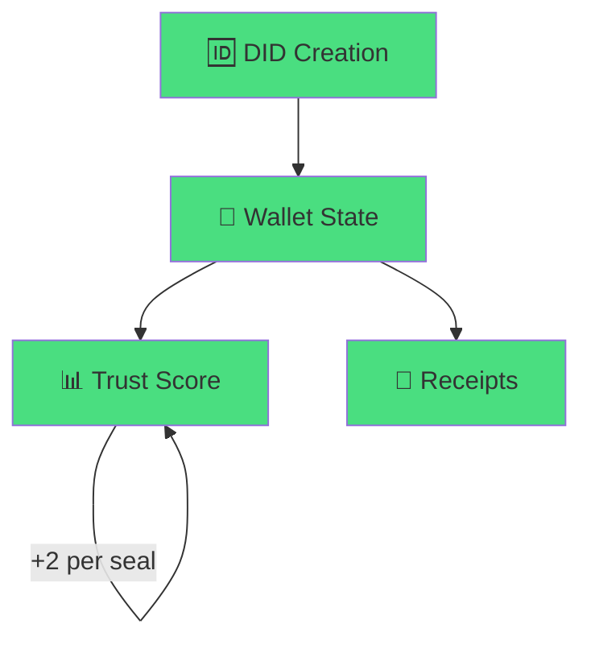
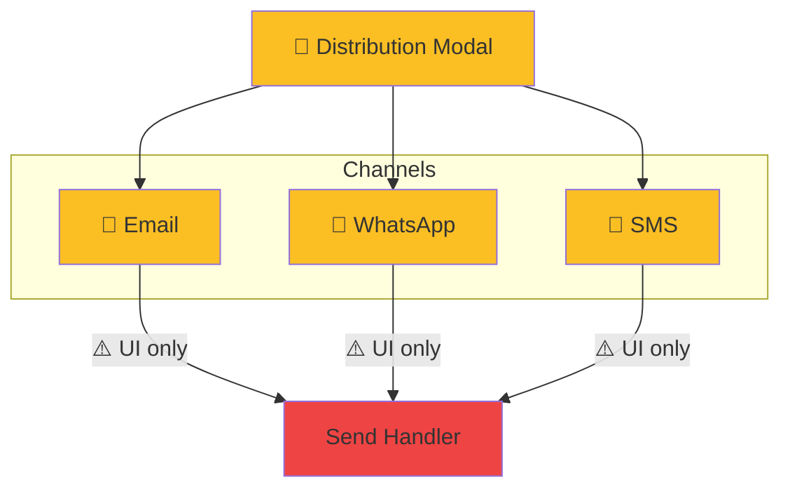
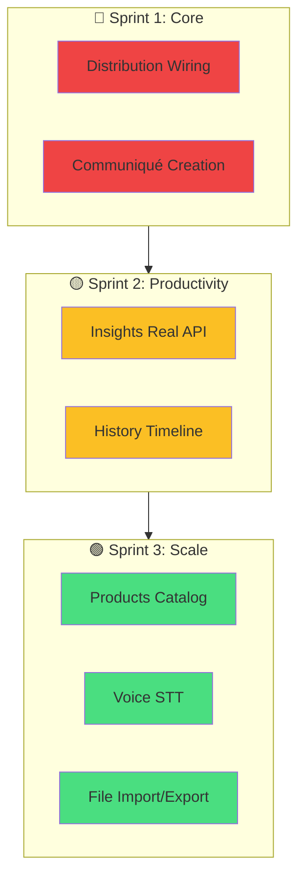

# WINDI PALETTE TOOL INVENTORY

> **Generated:** 2026-03-01
> **Source:** `/opt/windi/agent-palette/ui/index.html` (307.7 KB, ~8000 lines)
> **Status:** ~70% LIVE | ~20% PARTIAL | ~10% FALLBACK

---

## EXECUTIVE SUMMARY

The WINDI Palette is a **sovereign document production desktop** with integrated forensic infrastructure. The core pipeline (document creation → sealing → export → ledger → vault) is fully functional. Distribution channels and productivity tools need completion.

---

## ARCHITECTURE OVERVIEW



---

## SIDEBAR TABS INVENTORY



| # | Tab | Icon | Status | BE Endpoint | Output | Forensic |
|---|-----|------|--------|-------------|--------|----------|
| 1 | Chat | 💬 | ✅ LIVE | Dragon :8108, Local Motor | Messages, Documents | Via Events |
| 2 | Docs | 📄 | ✅ LIVE | Export :8103, Ledger :8101 | PDF/JMPG, Receipts | YES |
| 3 | Desk | 🎨 | ✅ LIVE | Local | Canvas layers | NO |
| 4 | Wallet | 👛 | ✅ LIVE | Local | DID, Trust, Receipts | YES |
| 5 | Search | 🔍 | ✅ LIVE | Local | Filtered results | NO |
| 6 | Files | 📁 | ⚠️ PARTIAL | localStorage | Doc list | NO |
| 7 | Journal | 📰 | ⚠️ PARTIAL | Communiqué :8105 | Article list | NO |
| 8 | Insights | 🧠 | ⚠️ PARTIAL | Cognition (demo) | Demo insights | NO |
| 9 | Products | 🛒 | 🔲 FALLBACK | — | — | — |
| 10 | History | 🕐 | 🔲 FALLBACK | — | — | — |

---

## DOCUMENT TYPES (16 Total)



### Document Type Details

| Tier | Type | Icon | Complexity | Seal | Dragon DNA | Status |
|------|------|------|------------|------|------------|--------|
| FREE | Letter | ✉️ | STRUCTURED | Merkle | Yes | ✅ LIVE |
| FREE | Email | 📧 | STRUCTURED | Merkle | Yes | ✅ LIVE |
| FREE | Note | 📝 | SIMPLE | SHA-256 | Yes | ✅ LIVE |
| FREE | Memo | 📋 | STRUCTURED | Merkle | Yes | ✅ LIVE |
| FREE | Journal | 📖 | SIMPLE | SHA-256 | Yes | ✅ LIVE |
| FREE | Recipe | 🍳 | STRUCTURED | SHA-256 | Yes | ✅ LIVE |
| MED | Report | 📊 | STRUCTURED | Merkle | Yes | ✅ LIVE |
| MED | Contract | 📜 | FORM | Merkle | Yes | ✅ LIVE |
| MED | Invoice | 💰 | FORM | Merkle | Yes | ✅ LIVE |
| MED | Protocol | 📒 | STRUCTURED | SHA-256 | Yes | ✅ LIVE |
| MED | Analysis | 🔬 | STRUCTURED | SHA-256 | Yes | ✅ LIVE |
| MED | Presentation | 📽️ | STRUCTURED | SHA-256 | Yes | ✅ LIVE |
| HIGH | Communiqué | 📡 | GOVERNANCE | Merkle | Yes | ✅ LIVE |
| HIGH | Certificate | 🏛️ | GOVERNANCE | Merkle | Yes | ✅ LIVE |
| HIGH | Creative Virtue | 🎨 | GOVERNANCE | Merkle | Yes | ✅ LIVE |
| HIGH | Brief | 📄 | GOVERNANCE | Merkle | Yes | ✅ LIVE |

---

## FORENSIC PIPELINE



### Pipeline Status

| Step | Component | Status | Notes |
|------|-----------|--------|-------|
| 1 | Document Creation | ✅ LIVE | All 16 types |
| 2 | DNA Guided Flow | ✅ LIVE | Field-by-field capture |
| 3 | Finalize Modal | ✅ LIVE | 2-step validation |
| 4 | Merkle Root | ✅ LIVE | Real SHA-256 |
| 5 | GDPR Redaction | ✅ LIVE | PII fields masked |
| 6 | Receipt Generation | ✅ LIVE | Cryptographic hash |
| 7 | EventBus Emission | ✅ LIVE | DOCUMENT_SEALED |
| 8 | Export JMPG | ✅ LIVE | Binary download |
| 9 | Ledger Registration | ⚠️ PARTIAL | API called, no verification |
| 10 | Vault Update | ⚠️ PARTIAL | Stats refresh, no storage |

---

## BACKEND SERVICES



### Endpoint Details

| Service | Port | Endpoints | Status |
|---------|------|-----------|--------|
| Dragon | 8108 | `POST /api/dragon` | ✅ Wired |
| Ledger | 8101 | `GET /health`, `POST /api/receipts` | ✅ Wired |
| Export | 8103 | `POST /api/export/jmpg` | ✅ Wired |
| Vault | 8106 | `GET /api/stats`, `GET /health` | ✅ Wired |
| Communiqué | 8105 | `GET /api/communique/list`, `/stats` | ✅ Wired |
| Desktop | 8110 | `POST /api/documents/create-from-dragon` | ⚠️ Partial |
| Sentinel | 8102 | — | 🔲 Not wired |
| Cortex | 8889 | — | 🔲 Not wired |

---

## FEATURE MODULES

### 1. Chat & Dragon Integration



| Feature | Status | Notes |
|---------|--------|-------|
| Local Motor (FREE) | ✅ LIVE | Deterministic responses |
| Dragon Chat (MED/HIGH) | ✅ LIVE | Constitutional AI |
| DNA Guided Flow | ✅ LIVE | Step-by-step fields |
| Document Extraction | ✅ LIVE | JSON blocks from Dragon |
| Title Capture | ✅ LIVE | awaitingTitle flag |

### 2. Wallet & DID



| Feature | Status | Notes |
|---------|--------|-------|
| DID Modal | ✅ LIVE | PF/PJ selector |
| Wallet Creation | ✅ LIVE | localStorage |
| Trust Score | ✅ LIVE | +2 per finalized doc |
| Receipt Tracking | ✅ LIVE | Array in wallet |
| Persistence | ✅ LIVE | CONFIG.STORAGE_KEY |

### 3. Distribution Channels



| Feature | Status | Notes |
|---------|--------|-------|
| Distribute Modal | ⚠️ PARTIAL | UI complete |
| Email Channel | ⚠️ PARTIAL | Form exists, no send |
| WhatsApp Channel | ⚠️ PARTIAL | Field exists, not wired |
| SMS Channel | ⚠️ PARTIAL | Field exists, no API |
| Schedule Send | 🔲 FALLBACK | Button exists, no calendar |
| Recipient List | ✅ LIVE | Add/remove in UI |

### 4. Free Desk (Canvas Editor)

| Feature | Status | Notes |
|---------|--------|-------|
| Canvas Rendering | ✅ LIVE | SVG + grid |
| Layer Management | ✅ LIVE | Add/remove/duplicate |
| Text Editing | ✅ LIVE | contentEditable |
| Image Upload | ✅ LIVE | FileAPI |
| Drag & Drop | ✅ LIVE | Mouse events |
| Resize Handles | ✅ LIVE | 8-point |
| Z-Order | ✅ LIVE | Forward/backward |
| Undo/Redo | ✅ LIVE | History array |
| Grid Toggle | ✅ LIVE | Show/hide |
| Zoom | ✅ LIVE | 0.3x - 2.0x |
| Export to JMPG | ⚠️ PARTIAL | Finalize exists |

---

## GAPS & PRIORITIES



### Priority Matrix

| Priority | Feature | Current | To Breathe |
|----------|---------|---------|------------|
| 🔴 HIGH | Distribution | ⚠️ UI only | Wire to Desktop :8110 |
| 🔴 HIGH | Communiqué Creation | ⚠️ List only | Add creation form in chat |
| 🟡 MED | Insights | 🔲 Demo | Fetch from Cognition API |
| 🟡 MED | History | 🔲 Empty | Action timeline |
| 🟢 LOW | Products | 🔲 Empty | Template catalog |
| 🟢 LOW | Voice | 🔲 Paste | Web Speech API |
| 🟢 LOW | Files | ⚠️ Local | Import/export external |

---

## TIER FEATURE MATRIX

| Feature | FREE | MED | HIGH |
|---------|------|-----|------|
| Chat (Local Motor) | ✅ | ✅ | ✅ |
| Chat (Dragon) | ❌ | ✅ | ✅ |
| Documents (6 base) | ✅ | ✅ | ✅ |
| Documents (MED+, 6) | ❌ | ✅ | ✅ |
| Documents (HIGH, 4) | ❌ | ❌ | ✅ |
| Export JMPG | ✅ | ✅ | ✅ |
| Forensic Ledger | ✅ | ✅ | ✅ |
| Vault Stats | ❌ | ✅ | ✅ |
| DID (Wallet) | ✅ | ✅ | ✅ |
| Distribution | ❌ | ✅ | ✅ |
| Communiqué View | ❌ | ❌ | ✅ |
| Insights | ❌ | ✅ | ✅ |
| Desk (Canvas) | ✅ | ✅ | ✅ |

---

## FALLBACK & PLACEHOLDER INDICATORS

### Found in Code

```javascript
// Products tab - button only, no UI
{id:"products",icon:"🛒",klass:"extra"}

// History tab - button only
{id:"history",icon:"🕐",klass:"extra"}

// DEMO_INSIGHTS fallback
const DEMO_INSIGHTS = {
  en: [{ type: 'momentum_score', text: '**MOMENTUM SCORE: 7.3 → 7.8**...' }],
  ...
};

// TODO: Wire to real actions
// TODO: Wire to real actions (invite_core_to_did, view_momentum_details, etc.)
```

---

## CONCLUSION

### What Works (✅ LIVE)

1. **Full Document Lifecycle** - All 16 types with real output
2. **Forensic Sealing** - Merkle roots, SHA-256, receipts
3. **Export Pipeline** - JMPG binary downloads
4. **Dragon Integration** - Constitutional chat, document extraction
5. **DID/Wallet** - Complete identity system
6. **Desk Canvas** - Full editor with layers

### What Needs Work (⚠️ PARTIAL)

1. **Distribution** - UI exists, no actual sending
2. **Communiqué** - List works, no creation
3. **Insights** - Always demo data
4. **Journal** - Fetch works, read-only

### What's Empty (🔲 FALLBACK)

1. **Products** - Button only
2. **History** - Button only
3. **Voice STT** - Manual paste

---

*"Gavetas principais estão cheias. Faltam as gavetas de conveniência."*

*ONE TREE respira. Cada ramo precisa de frutos.* 🌳🐉
