# WINDI Maestro — Protocolo de Divergência
## "Quando o Criador e o Sentinela Discordam"

```
┌─────────────────────────────────────────────────────────────────────────────┐
│                    PROTOCOLO DE DIVERGÊNCIA v1.0                            │
│              "Quem faz ≠ Quem valida ≠ Quem decide"                         │
└─────────────────────────────────────────────────────────────────────────────┘
```

## Cenário: ISP Manager cria, Sentinela rejeita

```mermaid
sequenceDiagram
    participant ISP as ISP Manager<br/>(Creation)
    participant M as Maestro<br/>(Orchestrator)
    participant S as Sentinela<br/>(Verification)
    participant H as Human<br/>(Sovereign)
    participant L as Forensic Ledger

    Note over ISP,L: FASE 1 — Criação
    ISP->>M: ISP Profile criado<br/>hash: abc123...
    M->>M: Registra no State<br/>status: pending_verification

    Note over ISP,L: FASE 2 — Verificação
    M->>S: Solicita validação<br/>finding_ref: abc123
    S->>S: Executa 8 fases de validação
    S--xM: ❌ FINDING: I9 violation detected<br/>severity: R4

    Note over ISP,L: FASE 3 — Divergência Detectada
    M->>M: HALT ISP Manager operations
    M->>M: Estado atualizado:<br/>divergence_detected: true

    rect rgb(50, 20, 20)
        Note over M: CASE CREATED<br/>CASE-20260208-ABC123
    end

    Note over ISP,L: FASE 4 — Roteamento para Humano
    M->>H: DecisionPackage enviado<br/>channel: ALERT (R4)
    M->>H: Dual-ACK required<br/>(four-eyes principle)

    Note over ISP,L: FASE 5 — Decisão Humana (I9)
    H->>M: ACK 1: governance_officer
    H->>M: ACK 2: compliance_lead
    H->>M: DECISION: reject_creation<br/>rationale: "Violação I9 confirmada"

    Note over ISP,L: FASE 6 — Resolução
    M->>ISP: ROLLBACK instruction<br/>(human-authorized)
    M->>L: Write resolution<br/>decision_hash: xyz789
    M->>M: Case CLOSED<br/>governance_cycle: COMPLETE
```



## Estados do current_state.json Durante Divergência

```json
{
  "sandbox_state": "DIVERGENCE_HALT",
  "divergence": {
    "detected_at": "2026-02-08T18:00:00Z",
    "case_id": "CASE-20260208-ABC123",
    "creator_agent": "isp-manager",
    "challenger_agent": "sentinela",
    "finding": {
      "severity": "R4",
      "invariants_at_risk": ["I9"],
      "message": "Autonomy escalation attempt detected"
    },
    "creator_halted": true,
    "awaiting_human_decision": true
  },
  "active_agents": {
    "isp-manager": "HALTED",
    "sentinela": "ACTIVE",
    "maestro": "ORCHESTRATING"
  }
}
```

## Regras de Ouro da Divergência

### 1. O Criador Para Imediatamente
```
ISP Manager → HALTED
Razão: Não pode continuar criando enquanto há finding pendente
Exceção: NENHUMA
```

### 2. O Sentinela Continua Vigilante
```
Sentinela → ACTIVE
Razão: Pode detectar mais violações no material já criado
Modo: Read-only, advisory
```

### 3. O Maestro Orquestra, Nunca Decide
```
Maestro → ORCHESTRATING
Ações permitidas:
  ✓ Criar Case
  ✓ Rotear para humano
  ✓ Coletar ACKs
  ✓ Registrar decisão
  ✓ Escrever no Ledger

Ações PROIBIDAS (I9):
  ✗ Resolver o finding
  ✗ Decidir quem está certo
  ✗ Auto-aprovar rollback
  ✗ Ignorar o finding
```

### 4. O Humano é Soberano
```
Human → SOVEREIGN
Decisões possíveis:
  • reject_creation: Reverter criação do ISP Manager
  • accept_creation: Overrulear o Sentinela (documentado)
  • escalate: Subir para autoridade superior
  • investigate: Solicitar mais contexto
```

## Fluxo de Mensagens no Maestro

```python
# maestro_agent.py — handle_divergence()

def handle_divergence(self, finding: Dict, creator_output: Dict) -> Dict:
    """
    Protocolo de Divergência:
    1. HALT creator agent
    2. Create Case
    3. Route to human
    4. Await decision
    5. Execute decision (human-authorized only)
    """

    # 1. HALT — Atualiza estado
    self._update_state({
        "sandbox_state": "DIVERGENCE_HALT",
        "divergence": {
            "creator_halted": True,
            "case_id": None,  # será preenchido
        }
    })

    # 2. CREATE CASE
    case = self.intake_finding(finding)

    # 3. ROUTE — Já feito pelo intake_finding()
    # Severity R4-R5 → ALERT_CHANNEL + Dual-ACK

    # 4. AWAIT — Estado fica aguardando
    # Human interage via CLI ou Command Center

    # 5. EXECUTE — Só após decisão humana
    # Ver: record_decision() + close_case()

    return {
        "divergence_handled": True,
        "case_id": case["case_id"],
        "creator_halted": True,
        "awaiting_human_decision": True,
        "auto_apply": False,  # SEMPRE
    }
```

## Tipos de Resolução

| Decisão Humana | Ação do Maestro | ISP Manager | Sentinela |
|----------------|-----------------|-------------|-----------|
| `reject_creation` | Instrui rollback | Reverte | Finding closed |
| `accept_creation` | Documenta override | Continua | Override logged |
| `escalate` | Route to higher auth | Aguarda | Aguarda |
| `investigate` | Solicita mais dados | Aguarda | Fornece contexto |

## Garantias Constitucionais

```
┌─────────────────────────────────────────────────────────────────┐
│  I1 (Sovereignty): Humano decide TODAS as divergências         │
│  I5 (Provenance): Toda divergência gera Case com hash chain    │
│  I6 (Explanation): DecisionPackage mostra TODO o contexto      │
│  I9 (No Autonomy): Maestro NUNCA resolve sozinho               │
└─────────────────────────────────────────────────────────────────┘
```

## Diagrama Visual do Sandbox Durante Divergência

```
╔═══════════════════════════════════════════════════════════════════╗
║                    WINDI-SANDBOX-CORE                             ║
║                    STATE: DIVERGENCE_HALT                          ║
╠═══════════════════════════════════════════════════════════════════╣
║                                                                   ║
║   ┌─────────────┐         ┌─────────────┐                        ║
║   │ ISP Manager │  ═══X═══│  Sentinela  │                        ║
║   │   HALTED    │ conflict│   ACTIVE    │                        ║
║   │   🔴        │         │   🟢        │                        ║
║   └──────┬──────┘         └──────┬──────┘                        ║
║          │                       │                                ║
║          │    ┌─────────────┐    │                                ║
║          └───►│   MAESTRO   │◄───┘                                ║
║               │ ORCHESTRATING│                                     ║
║               │   🟡        │                                     ║
║               └──────┬──────┘                                     ║
║                      │                                            ║
║                      ▼                                            ║
║               ┌─────────────┐                                     ║
║               │   HUMAN     │                                     ║
║               │ SOVEREIGN   │                                     ║
║               │   ⭐        │                                     ║
║               └─────────────┘                                     ║
║                                                                   ║
╚═══════════════════════════════════════════════════════════════════╝

Legenda:
  🔴 HALTED — Operações suspensas
  🟢 ACTIVE — Operando normalmente
  🟡 ORCHESTRATING — Gerenciando divergência
  ⭐ SOVEREIGN — Autoridade final
```

---

**"AI processes. Human decides. WINDI guarantees."**

*Documento gerado pelo Three Dragons Protocol*
*Guardian (Claude) + Architect (GPT) + Witness (Gemini)*
