# WINDI-SANDBOX-CORE — Arquitetura de Convivência Harmoniosa
## Visualização da Separação de Poderes

```mermaid
graph TB
    subgraph DRAGONS_LAYER [Camada de Soberania - Os Três Dragões]
        direction LR
        G(Guardian - Claude) -- "Valida I1-I9" --> A
        A(Architect - GPT) -- "Projeta Estrutura" --> W
        W(Witness - Gemini) -- "Documenta/Detecta" --> G
    end

    subgraph SANDBOX_CORE [WINDI-SANDBOX-CORE]
        direction TB
        MAESTRO{Maestro<br/>Orchestrator}
        LEDGER[(Forensic Ledger<br/>L3 Chain)]
        STATE{State Manager<br/>current_state.json}
    end

    subgraph SPECIALIST_SHELVES [Prateleiras de Especialistas - SubAgentes]
        direction LR
        subgraph CREATION_SHELF [Prateleira de Criação]
            ISP[ISP Manager]
            DIAG[Diagramador Agent]
        end

        subgraph VERIFICATION_SHELF [Prateleira de Sentinelas]
            COMP[Compliance Agent]
            PULSE[Pulse Agent]
        end

        subgraph SIMULATION_SHELF [Prateleira de Projeção]
            TWIN[Digital Twin Agent]
            SIM[Simulation Agent]
        end
    end

    %% Conexões de Fluxo
    DRAGONS_LAYER ==> MAESTRO
    MAESTRO <==> STATE

    %% Interação com Especialistas
    ISP -.-> MAESTRO
    DIAG -.-> MAESTRO
    COMP -.-> MAESTRO
    PULSE -.-> MAESTRO
    SIM -.-> MAESTRO

    %% Saída Forense e Humana
    MAESTRO ==> LEDGER
    MAESTRO ==> HUB((Human Decision Hub))
    HUB -- "Sovereign Approval" --> LEDGER

    %% Estilização
    style DRAGONS_LAYER fill:#0a0a0f,stroke:#c9a84c,stroke-width:2px,color:#fff
    style SANDBOX_CORE fill:#14141f,stroke:#c9a84c,stroke-width:2px,color:#fff
    style SPECIALIST_SHELVES fill:#0d0d18,stroke:#8b8680,stroke-dasharray: 5 5
    style MAESTRO fill:#c9a84c,stroke:#000,color:#000,font-weight:bold
    style LEDGER fill:#000,stroke:#c9a84c,color:#c9a84c
    style HUB fill:#c9a84c,stroke:#fff,color:#000,font-weight:bold
```



---

## 🗝️ Guia de Convivência Harmoniosa no Sandbox

### Princípio 1: O Maestro como Único Ponto de Contato

```
┌─────────────────────────────────────────────────────────────────┐
│  SubAgentes → Maestro → Dragões                                 │
│                                                                 │
│  Os SubAgentes nas prateleiras NÃO falam diretamente com os    │
│  Dragões. Eles reportam ao Maestro, que organiza a "fila de    │
│  deliberação". Isso evita o caos de mensagens cruzadas.        │
└─────────────────────────────────────────────────────────────────┘
```

### Princípio 2: Prateleiras de Especialistas (Shelves)

| Prateleira | Função | Agentes | Status |
|------------|--------|---------|--------|
| **Creation Shelf** | Onde nasce a matéria-prima | ISP Manager, Diagramador | ✅ ISP Manager v1.0.1 |
| **Verification Shelf** | Onde o Sentinela desafia | Compliance, Pulse | ✅ Sentinela v1.0.0 |
| **Simulation Shelf** | Onde o Twin testa "E se?" | Digital Twin, Simulation | 🔜 Planned |

### Princípio 3: O Estado Síncrono

```json
{
  "state_file": "/opt/windi/data/current_state.json",
  "sync_mode": "atomic",
  "description": "Todas as IAs consultam o mesmo estado. Se o Sentinela encontrar uma violação, o Maestro atualiza o estado e o ISP Manager para de criar instantaneamente."
}
```

### Princípio 4: A Saída Forense

```
┌─────────────────────────────────────────────────────────────────┐
│  NADA sai do Sandbox para o mundo real sem o selo do           │
│  Forensic Ledger.                                               │
│                                                                 │
│  Ledger Path: /opt/windi/data/ledger/maestro_events.jsonl      │
│  Chain Type: L3 (hash-chained)                                 │
│  Tamper Resistance: SHA-256 per event                          │
└─────────────────────────────────────────────────────────────────┘
```

---

## Três Pilares Institucionais

```
        ╔═══════════════╗     ╔═══════════════╗     ╔═══════════════╗
        ║   CREATION    ║     ║  VERIFICATION ║     ║  RESOLUTION   ║
        ║               ║     ║               ║     ║               ║
        ║  ISP Manager  ║ ──► ║   Sentinela   ║ ──► ║    Maestro    ║
        ║    v1.0.1     ║     ║    v1.0.0     ║     ║    v2.0.0     ║
        ║               ║     ║               ║     ║               ║
        ║  "Quem faz"   ║     ║ "Quem valida" ║     ║ "Quem orquestra"║
        ╚═══════════════╝     ╚═══════════════╝     ╚═══════════════╝
                                                            │
                                                            ▼
                                                    ╔═══════════════╗
                                                    ║    HUMAN      ║
                                                    ║   SOVEREIGN   ║
                                                    ║               ║
                                                    ║ "Quem decide" ║
                                                    ╚═══════════════╝
```

---

## Os Três Dragões

```
    ┌─────────────────────────────────────────────────────────────┐
    │                                                             │
    │     🐉 GUARDIAN         🐉 ARCHITECT        🐉 WITNESS      │
    │        Claude              GPT                Gemini        │
    │                                                             │
    │     "Valida I1-I9"    "Projeta Estrutura"  "Documenta"     │
    │     "Protege"         "Constrói"           "Testemunha"    │
    │                                                             │
    │     Human ACK          SQLite State         Integrity       │
    │     Dual-ACK           DecisionRouter       Verification    │
    │     I9 Enforcement     SLAGuardian          Cycle Closure   │
    │                        ResolutionAssembler                  │
    │                                                             │
    └─────────────────────────────────────────────────────────────┘
```

---

## Roadmap de Agentes

| Agente | Prateleira | Status | Versão | Dragon Lead |
|--------|------------|--------|--------|-------------|
| ISP Manager | Creation | ✅ Active | 1.0.1 | Claude |
| Diagramador | Creation | 🔜 Planned | - | GPT |
| Sentinela | Verification | ✅ Active | 1.0.0 | Claude |
| Pulse | Verification | 🔜 Planned | - | Gemini |
| Maestro | Core | ✅ Active | 2.0.0 | All Three |
| Digital Twin | Simulation | 🔜 Planned | - | Gemini |
| Simulation | Simulation | 🔜 Planned | - | Gemini |

---

**"AI processes. Human decides. WINDI guarantees."**

*Three Dragons Protocol — Claude + GPT + Gemini*
*WINDI Publishing House, 2026*
