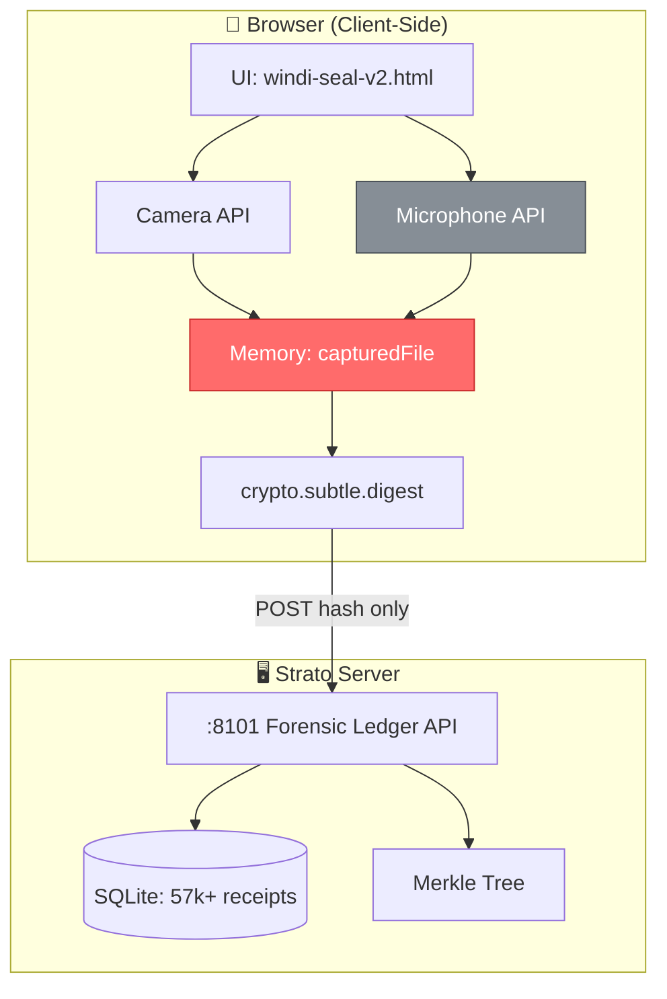
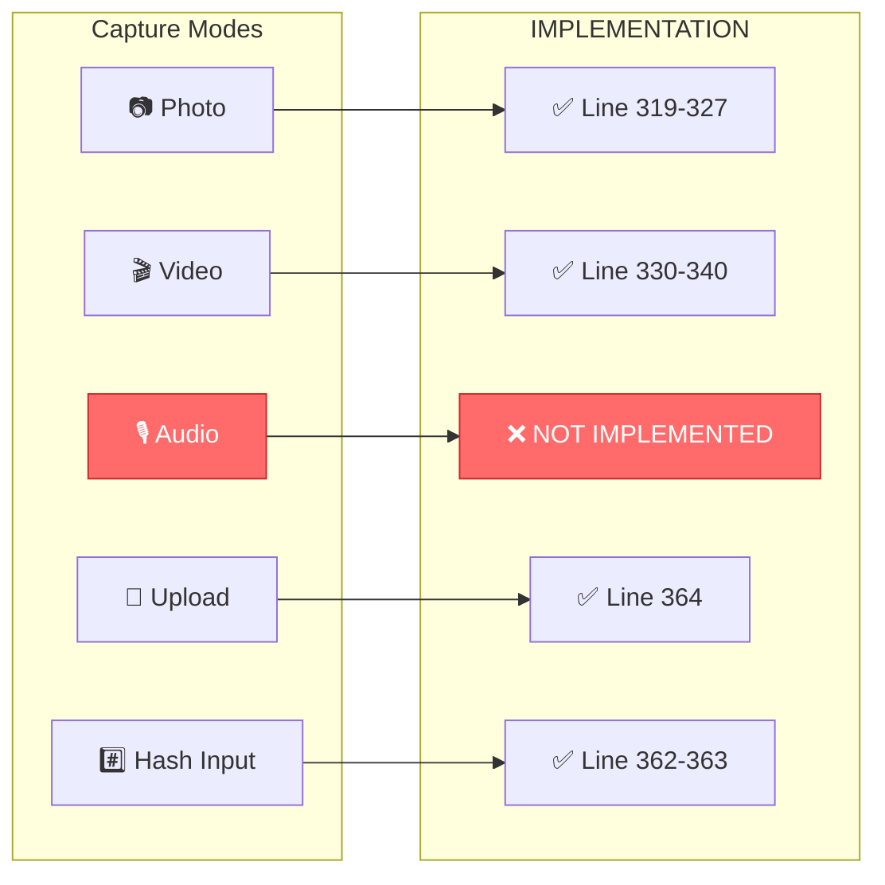
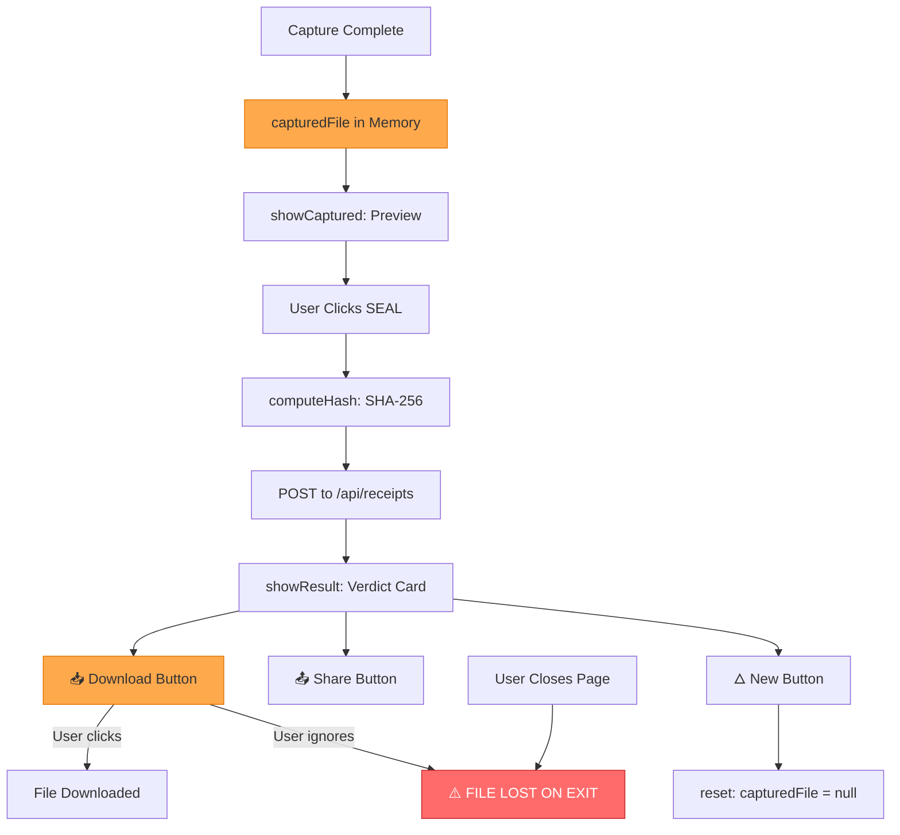
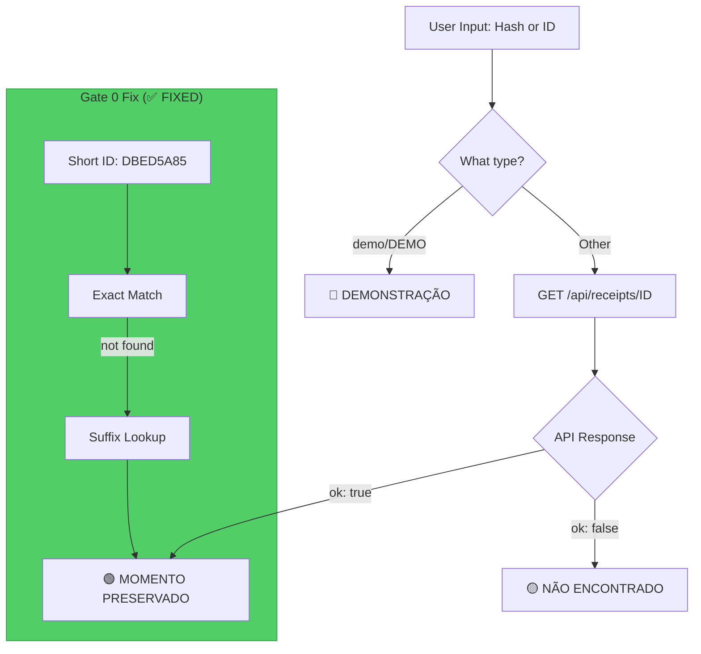
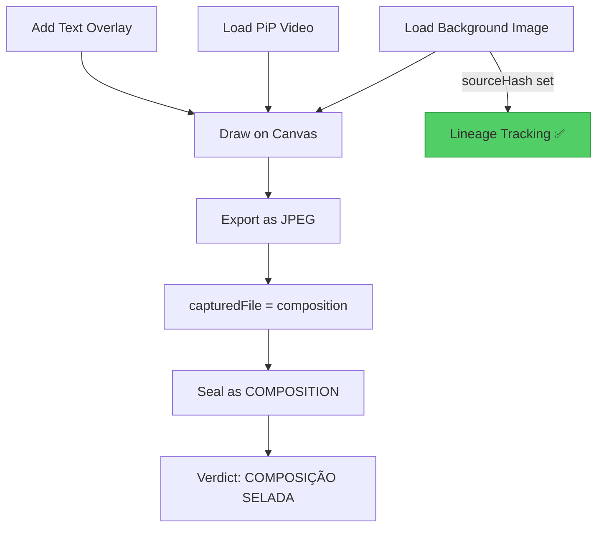
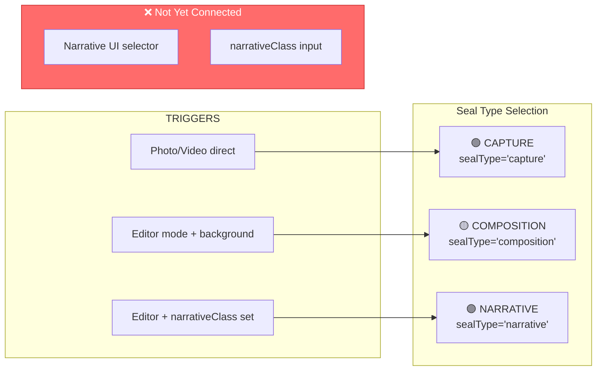
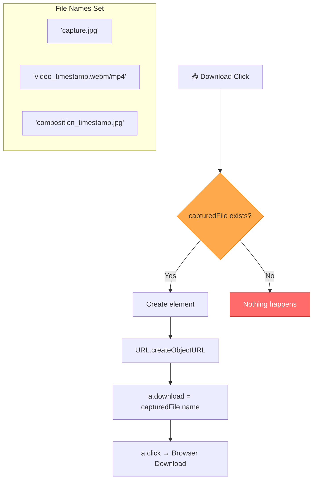
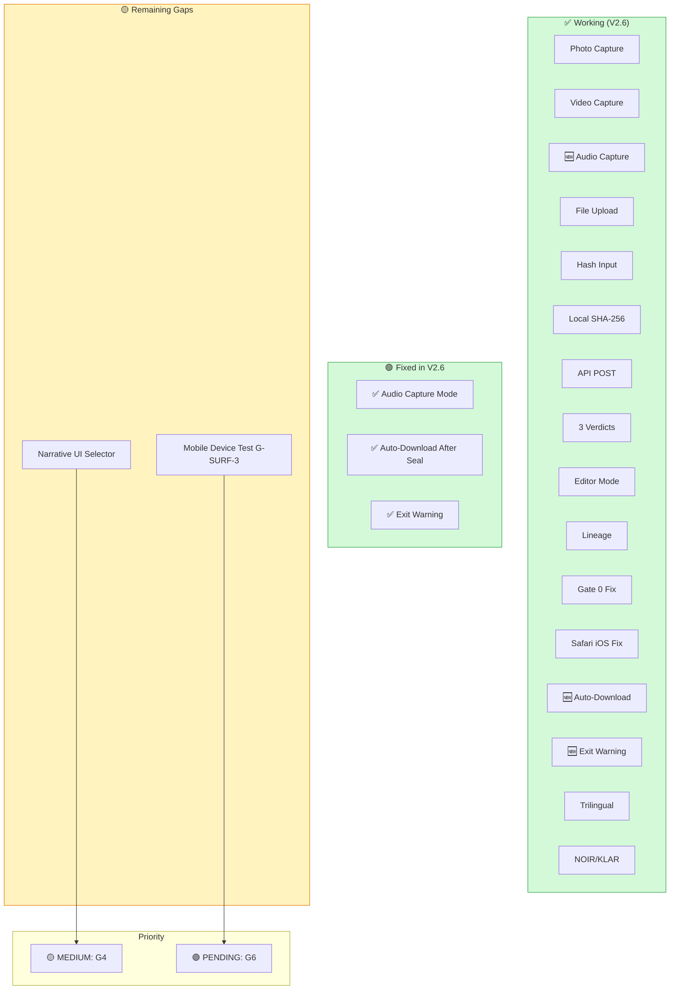
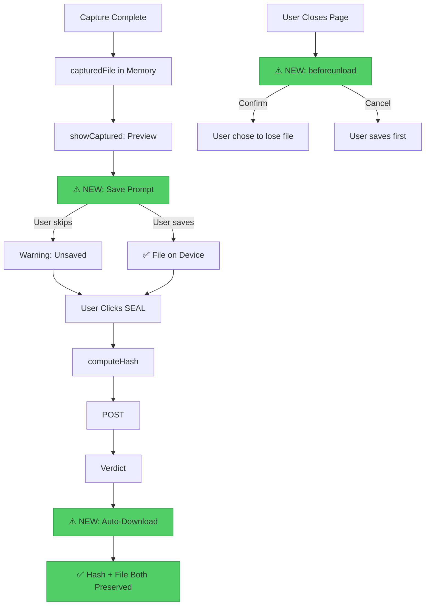

# WINDI SEAL V2.6 — Current State Diagram
**Data:** 2026-06-11 · **Hash:** `28e0073b6d0ad9ec`
**Propósito:** Visualização exacta do código actual para detecção de gaps por IAs do Conselho
**Status:** 🟢 GAPS CRÍTICOS CORRIGIDOS

---

## 1. Architecture Overview (ACTUAL)

**🔴 GAPS VISÍVEIS:**
- `MEM` (vermelho): Ficheiro em memória, pode perder-se
- `MIC` (cinzento): Áudio não implementado

---

## 2. Capture Flow (ACTUAL)

---

## 3. Post-Capture Flow (ACTUAL) — WHERE GAP LIVES

**🔴 GAP:** Não há:
1. Auto-download após seal
2. Warning ao fechar página
3. Prompt "Guarde antes de sair"

---

## 4. Verify Flow (ACTUAL)

---

## 5. Editor/Composition Flow (ACTUAL)

---

## 6. Three Seal Types (ACTUAL)

**🔴 GAP:** `narrativeClass` e selector UI para NARRATIVE não implementados completamente

---

## 7. Download Handler (ACTUAL CODE)

---

## 8. What's Missing (GAP SUMMARY) — V2.6 UPDATE

---

## 9. Proposed Fix Architecture

---

## 10. Code Line Reference

| Feature | Line(s) | Status |
|---------|---------|--------|
| Photo capture | 319-327 | ✅ |
| Video capture | 330-340 | ✅ |
| Audio capture | — | ❌ MISSING |
| File upload | 364 | ✅ |
| Hash input | 362-363 | ✅ |
| computeHash | 507-513 | ✅ |
| API call | 517-529 | ✅ |
| showResult | 532-600 | ✅ |
| Download handler | 614 | ⚠️ EXISTS but passive |
| Auto-download | — | ❌ MISSING |
| Exit warning | — | ❌ MISSING |
| Audio mode | — | ❌ MISSING |
| Narrative selector | — | ❌ MISSING |

---

*Este documento permite que qualquer IA do Conselho detecte visualmente onde estão os gaps e o que precisa ser alterado.*

*AI processes. Human decides. WINDI guarantees.*
