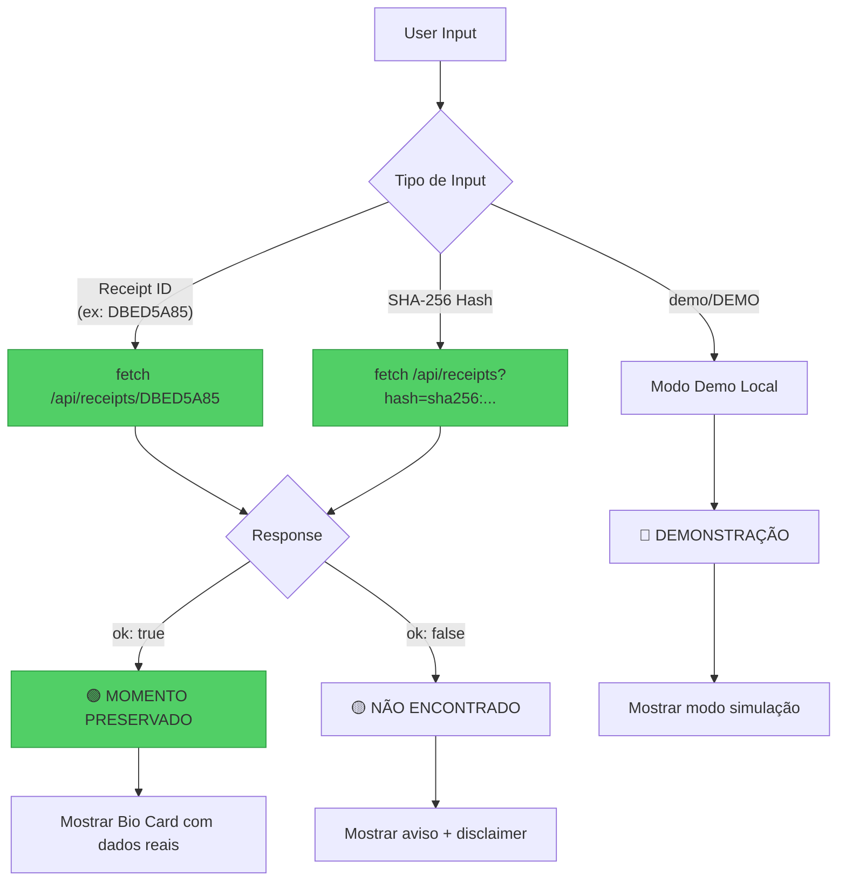

# WINDI SEAL — VERIFY Flow Gap Analysis
**Data:** 2026-06-11
**Status:** ✅ CORRIGIDO em V2.8 (`FD9C54FB`)
**Descoberta:** Human Dragon ("falta o VERIFY")
**Fix:** CCode implementou `verifyInLedger()` + `runVerify()`

---

## 1. O Que DEVERIA Existir (Arquitectura Esperada)

```mermaid
flowchart TD
    subgraph TABS ["3 Tabs Esperados"]
        T1[📷 CAPTURA]
        T2[🎬 COMPOSIÇÃO]
        T3[🔍 VERIFICAR]
    end

    T3 --> INPUT[Input: Hash ou Receipt ID]
    INPUT --> API[GET /api/receipts/{id}]

    API --> CHECK{API Response}
    CHECK -->|"ok: true"| FOUND[🟢 MOMENTO PRESERVADO<br/>Hash encontrado no Ledger]
    CHECK -->|"ok: false"| NOT_FOUND[🟡 NÃO ENCONTRADO<br/>Não existe no Ledger]
    CHECK -->|"demo/DEMO"| DEMO[🔵 DEMONSTRAÇÃO<br/>Modo simulação]

    style T3 fill:#51cf66,stroke:#2f9e44
    style API fill:#51cf66,stroke:#2f9e44
    style FOUND fill:#51cf66,stroke:#2f9e44
```

---

## 2. O Que EXISTE Agora (Código Actual)

```mermaid
flowchart TD
    subgraph TABS ["2 Tabs Existentes"]
        T1[📷 CAPTURA]
        T2[🎬 COMENTAR]
    end

    subgraph CAPTURE_MODES ["Dentro de CAPTURA"]
        M1[📷 Foto]
        M2[🎬 Vídeo]
        M3[🎙️ Áudio]
        M4[📄 Upload]
        M5[#️⃣ Hash]
    end

    T1 --> CAPTURE_MODES
    M5 --> INPUT[Input: Hash]
    INPUT --> LOCAL[Compute SHA-256 LOCAL]
    LOCAL --> ANIM[Animação "Selagem"]
    ANIM --> RESULT[showResult status='demo']
    RESULT --> ALWAYS[🟢 MOMENTO CAPTURADO<br/>SEMPRE mostra sucesso!]

    style M5 fill:#ff6b6b,stroke:#c92a2a,color:#fff
    style ALWAYS fill:#ff6b6b,stroke:#c92a2a,color:#fff
```

**🔴 PROBLEMA:** O modo Hash NÃO verifica no Ledger. Apenas calcula hash local e mostra "sucesso".

---

## 3. Gaps Identificados

```mermaid
flowchart TD
    subgraph MISSING ["❌ O Que Falta"]
        G1[Tab VERIFICAR separado]
        G2[Chamada fetch à API]
        G3[3 estados de resultado]
        G4[Lookup por Receipt ID]
        G5[Lookup por Hash SHA-256]
    end

    subgraph EXISTS ["✅ O Que Existe"]
        E1[Gate 0 Fix no servidor]
        E2[API /api/receipts/{id} funciona]
        E3[Suffix lookup funciona]
        E4[57k+ receipts no Ledger]
    end

    G2 -.->|"precisa conectar"| E2

    style MISSING fill:#ffe3e3,stroke:#c92a2a
    style EXISTS fill:#d3f9d8,stroke:#2f9e44
```

---

## 4. Código Actual (Linha 617-618)

```javascript
// runScan() - linha 617-618
const hash = capturedFile ? await computeHash(capturedFile) : 'demo';
showResult({status:'demo', hash});  // ❌ SEMPRE 'demo', nunca verifica!
```

**Não há:**
- `fetch('/api/receipts/...')`
- Verificação real no Ledger
- Diferenciação entre FOUND/NOT_FOUND

---

## 5. Fix Necessário



---

## 6. Proposta de Implementação

### 6.1 Adicionar Tab VERIFICAR
```html
<button class="mode-tab" data-mode="verify" id="tabVerify">🔍 VERIFICAR</button>
```

### 6.2 Nova Função verifyInLedger()
```javascript
async function verifyInLedger(input) {
  // Detect input type
  const isReceiptId = input.match(/^[A-Z0-9-]+$/i);
  const isHash = input.startsWith('sha256:');

  if (input.toLowerCase() === 'demo') {
    return { status: 'demo', hash: 'demo' };
  }

  try {
    const url = isHash
      ? `https://windi-domain.com/api/receipts?hash=${encodeURIComponent(input)}`
      : `https://windi-domain.com/api/receipts/${input}`;

    const res = await fetch(url);
    const data = await res.json();

    if (data.ok) {
      return {
        status: 'found',
        receipt: data.receipt,
        hash: data.receipt.content_hash
      };
    } else {
      return { status: 'not_found', input };
    }
  } catch (e) {
    return { status: 'error', message: e.message };
  }
}
```

### 6.3 Actualizar showResult()
```javascript
function showResult(result) {
  if (result.status === 'found') {
    // 🟢 MOMENTO PRESERVADO - dados reais do Ledger
    card.classList.add('verified');
    $('#verdictTitle').textContent = t('momentPreserved');
    $('#bioDate').textContent = new Date(result.receipt.created_at * 1000).toLocaleString();
    $('#bioAuthor').textContent = result.receipt.actor;
  } else if (result.status === 'not_found') {
    // 🟡 NÃO ENCONTRADO
    card.classList.add('missing');
    $('#verdictTitle').textContent = t('notFound');
  } else if (result.status === 'demo') {
    // 🔵 DEMONSTRAÇÃO
    card.classList.add('demo');
    $('#verdictTitle').textContent = t('demonstration');
  }
}
```

---

## 7. ✅ FIX IMPLEMENTADO (V2.8)

### Código Adicionado

```javascript
// verifyInLedger() — chama API real
async function verifyInLedger(input){
  if(input.toLowerCase()==='demo') return {status:'demo'};
  const res = await fetch(`https://windi-domain.com/api/receipts/${input}`);
  const data = await res.json();
  if(data.ok) return {status:'found', receipt:data.receipt};
  return {status:'not_found', input};
}
```

### Fluxo Corrigido

```mermaid
flowchart TD
    INPUT[User Input: Hash ou ID] --> API[fetch /api/receipts/{id}]
    API --> CHECK{Response}

    CHECK -->|"ok: true"| FOUND[🟢 MOMENTO PRESERVADO<br/>Dados reais do Ledger]
    CHECK -->|"ok: false"| NOT_FOUND[🟡 NÃO ENCONTRADO<br/>Com disclaimer]
    CHECK -->|"demo"| DEMO[🔵 DEMONSTRAÇÃO]

    FOUND --> BIO[Bio Card com:<br/>- Data real<br/>- Actor real<br/>- Hash real]

    style FOUND fill:#51cf66,stroke:#2f9e44
    style NOT_FOUND fill:#ffd43b,stroke:#fab005
    style DEMO fill:#339af0,stroke:#1c7ed6
```

### Receipt Selado

```
ID:   WINDI-SEAL-V28-20260611195228-FD9C54FB
Hash: fd9c54fb3bd0ce0b
```

---

*Gate 0 servidor + Gate 0 cliente = Funil da curiosidade OPERACIONAL!*

*AI processes. Human decides. WINDI guarantees.*
