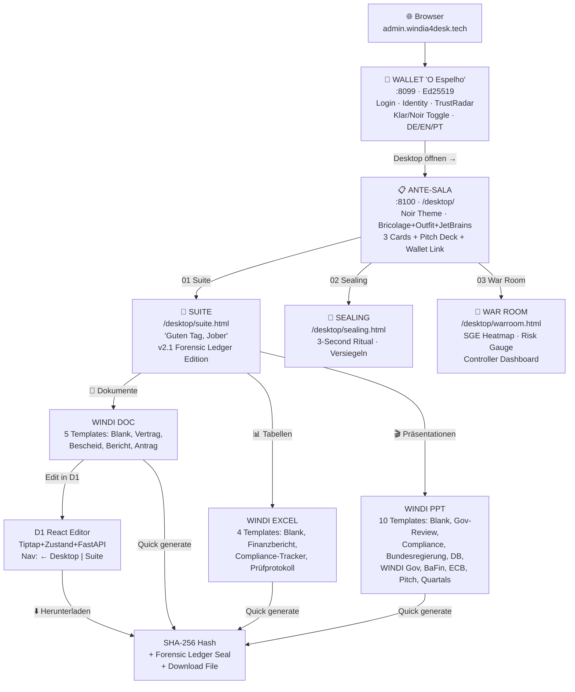
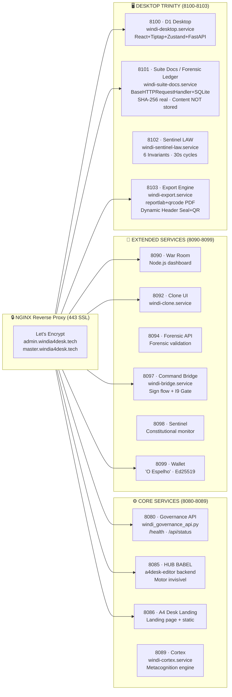
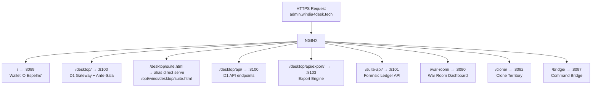
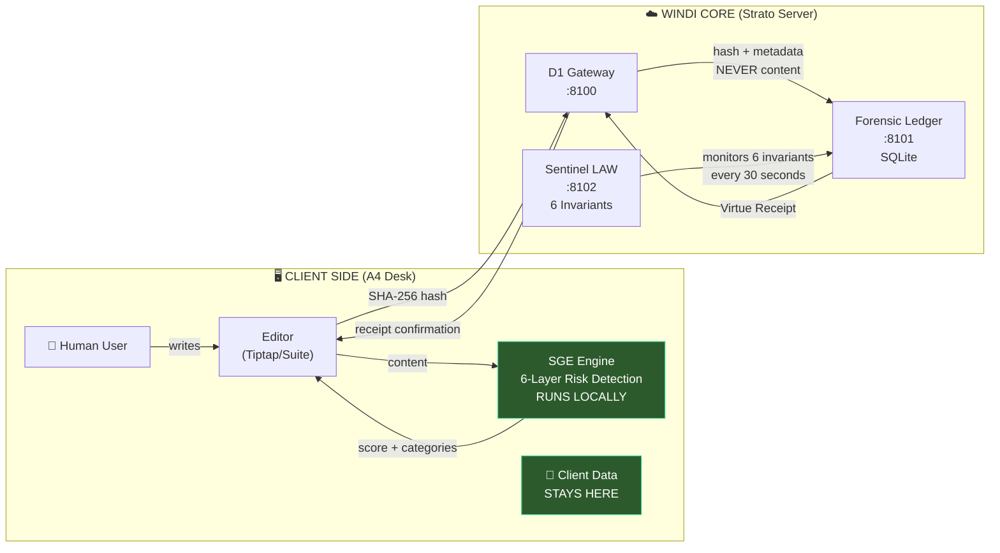
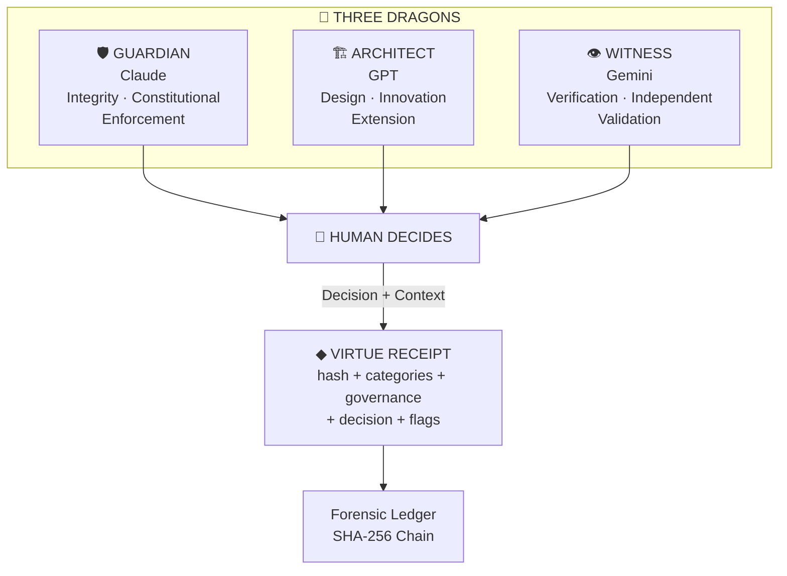
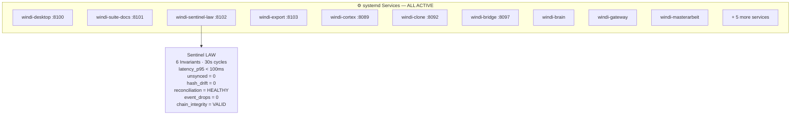
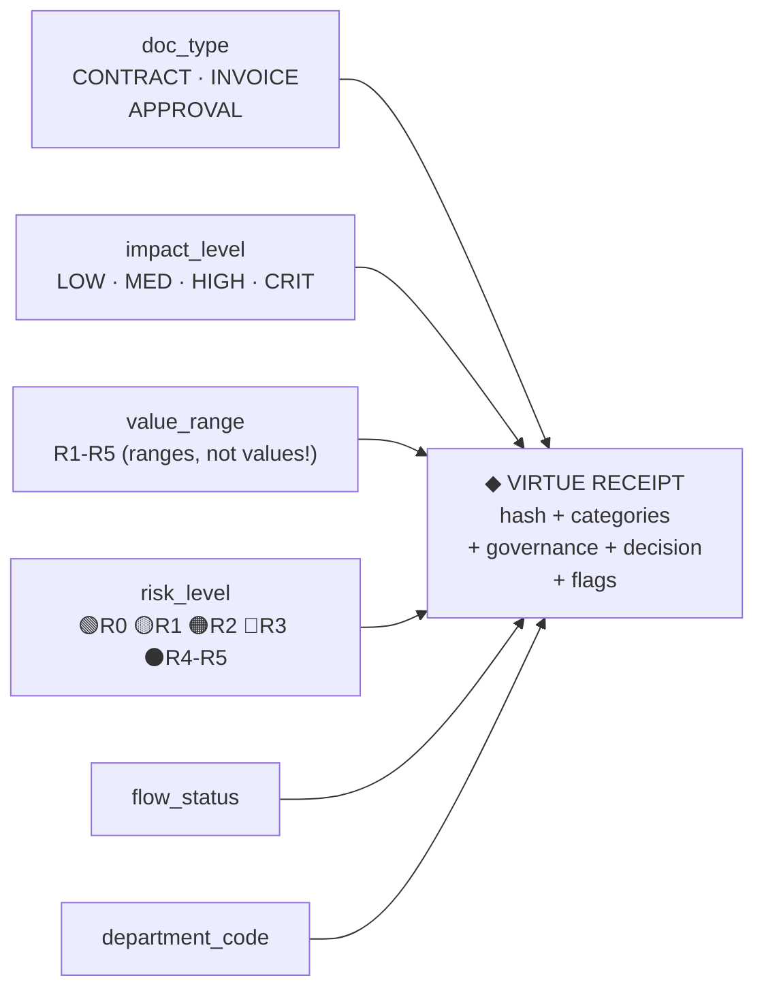
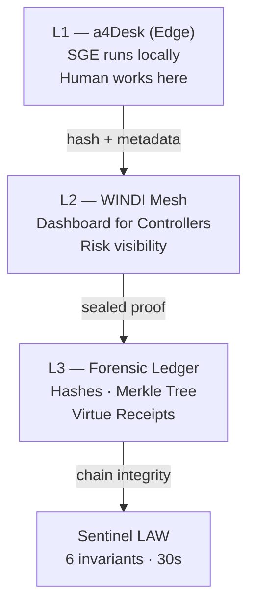

# WINDI System Architecture — Complete Reference
### 17 February 2026 · v2.1.0
### *AI processes. Human decides. WINDI guarantees.*

---

## 1. USER JOURNEY — What the Human Sees



---

## 2. SERVICE INFRASTRUCTURE — Ports & systemd



---

## 3. NGINX ROUTING MAP



---

## 4. DATA FLOW — Zero-Knowledge Architecture



**Zero-Knowledge Principle:**
- SGE runs on CLIENT side
- WINDI Core receives ONLY: hash + categories + metadata + decision
- ZERO sensitive data crosses the wire
- Client keeps data, WINDI keeps PROOF of virtue

---

## 5. TEMPLATE INVENTORY

### 5.1 Dokumente (5 templates)
| # | Template | Governance | Content |
|---|----------|-----------|---------|
| 1 | Neues Dokument | LOW | Blank page |
| 2 | Vertrag | HIGH | Dienstleistungsvertrag with §1-§6 |
| 3 | Bescheid | HIGH | Governance-Entscheidung with Rechtsbehelfsbelehrung |
| 4 | Bericht | MEDIUM | Governance-Bericht Q1-Q4 |
| 5 | Antrag | MEDIUM | Genehmigungsantrag with Anlagen |

### 5.2 Tabellen (4 templates)
| # | Template | Governance | Columns |
|---|----------|-----------|---------|
| 1 | Leere Tabelle | LOW | ID, Name, Wert, Status, Datum |
| 2 | Finanzbericht | HIGH | Kategorie, Budget, Ausgaben, Verbleibend, %, Risiko |
| 3 | Compliance-Tracker | HIGH | #, Anforderung, Status, Verantwortlich, Fällig, Nachweis, Risiko |
| 4 | Prüfprotokoll | HIGH | #, Zeitstempel, Aktion, Akteur, Dokument, Governance, SGE, Hash, Status |

### 5.3 Präsentationen (10 templates)
| # | Template | ISP | Governance | Slides |
|---|----------|-----|-----------|--------|
| 1 | Leere Präsentation | — | LOW | 1 |
| 2 | Governance-Review | — | HIGH | 4 |
| 3 | Compliance-Report | — | HIGH | 3 |
| 4 | Bundesregierung | Bundesregierung | HIGH | 5 |
| 5 | Deutsche Bahn | Deutsche Bahn | HIGH | 5 |
| 6 | WINDI Governance | WINDI | HIGH | 5 |
| 7 | BaFin Bericht | BaFin | HIGH | 5 |
| 8 | ECB / EZB Analyse | ECB | HIGH | 5 |
| 9 | Pitch Deck | WINDI | MEDIUM | 6 |
| 10 | Quartals-Review | — | MEDIUM | 5 |

**Total: 19 templates · 44 slides · 5 ISP profiles**

---

## 6. THREE DRAGONS PROTOCOL



---

## 7. SYSTEMD SERVICES — 16 Active



**Stress Test Results (Linhagem de Ferro):**
- 100 receipts: 0 drops, 0 drift
- p50 = 34ms, p95 = 52ms
- LAW = 6 invariants / 30s cycles

---

## 8. FILE SYSTEM STRUCTURE

```
/opt/windi/
├── desktop/                    # D1 Desktop Trinity
│   ├── backend/                # FastAPI gateway (d1_gateway.py)
│   ├── frontend/               # React source
│   ├── static/                 # Compiled React app
│   ├── index.html              # Ante-Sala landing
│   ├── suite.html              # Suite v2.1 (19 templates)
│   ├── sealing.html            # Sealing ritual
│   └── warroom.html            # War Room dashboard
├── suite-docs/                 # Forensic Ledger API
│   └── windi_forensic_api.py   # :8101 BaseHTTPRequestHandler
├── engine/                     # 28 governance modules
│   └── semantic_governance.py  # SGE v1.0 (6 layers)
├── a4desk-editor/              # HUB BABEL (:8085)
├── a4desk-landing/             # Landing page (:8086)
├── bridge/                     # Command Bridge (:8097)
├── clone/                      # Clone UI (:8092)
├── war-room/                   # War Room (:8090)
├── wallet/                     # Wallet "O Espelho" (:8099)
├── ppt-engine/                 # PPT generator
│   └── output/                 # 3 PPTX + PDFs + JPGs
├── isp/                        # 17 ISP profiles
├── data/                       # SQLite DBs
│   └── forensic_ledger.sqlite3 # Virtue Receipts
├── logs/                       # Centralized logs
├── backups/                    # Pre-change backups
└── tsil/                       # Secrets (chmod 600)
```

---

## 9. DOMAIN & SSL

| Domain | Points To | SSL |
|--------|-----------|-----|
| admin.windia4desk.tech | 87.106.29.233 | Let's Encrypt ✅ |
| master.windia4desk.tech | 87.106.29.233 | Let's Encrypt ✅ |

---

## 10. GOVERNANCE METADATA



---

## 11. BUSINESS MODEL

```
Instruments without data.
Client stores terabytes. WINDI stores protocol.

Tier 1 (Free):       3 users · Basic governance
Tier 2 (Pro):        €25-40/user · Full SGE + Sealing
Tier 3 (Enterprise): €80-120/user · Forensic Ledger + War Room

Target: GRC market €65B
Compliance: BSI C5 + ISO 27001
```

---

## 12. 3-LAYER ARCHITECTURE



**Data on client. Proof on WINDI.**

---

## 13. NEXT MILESTONES

- [ ] SIP Layer 1 — Passphrase hash (real authentication)
- [ ] Paperless.io — eIDAS digital signatures
- [ ] M3 Dynamic Header Seal — LibreOffice mockup reference
- [ ] Hetzner migration — BSI C5 production environment
- [ ] Load testing — 100 concurrent users
- [ ] ISO 27001 certification

---

*Generated: 17 February 2026*
*Guardian (Claude) · Architect (GPT) · Witness (Gemini)*
*"AI processes. Human decides. WINDI guarantees."*
