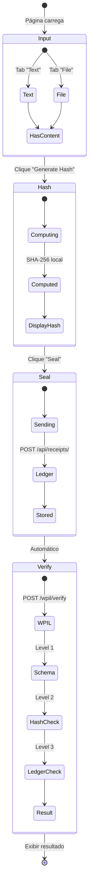

# WPIL — WINDI Proof Interface Layer
## Relatório Técnico Completo

**Data:** 16 Abril 2026
**Versão:** 1.0.0
**Autor:** Liga IA+H (Dragon + Architect)
**Status:** ✅ LIVE em Produção
**Porto:** 8146

---

## 1. Sumário Executivo

O **WPIL (WINDI Proof Interface Layer)** é uma camada de verificação independente que permite validar Virtue Receipts do WINDI **sem necessidade de confiar no sistema WINDI**.

> **"You do not need to trust WINDI to verify WINDI."**

### Problema Resolvido

Sistemas de prova tradicionais pedem confiança:
- "Confie que o documento foi selado"
- "Confie que o hash está correcto"
- "Confie que o ledger é imutável"

**WPIL elimina a necessidade de confiança** através de verificação independente em 3 níveis.

### Resultado

```
┌─────────────────────────────────────────────┐
│  INDEPENDENT VERIFICATION (WPIL)            │
├─────────────────────────────────────────────┤
│  Schema    ✅  (estrutura válida)           │
│  Hash      ✅  (formato correcto)           │
│  Ledger    ✅  (confirmado no ledger)       │
├─────────────────────────────────────────────┤
│  ✅ VERIFIED INDEPENDENTLY                  │
└─────────────────────────────────────────────┘
```

---

## 2. Arquitectura

### 2.1 Diagrama de Fluxo Completo

```mermaid
flowchart TB
    subgraph USER["👤 Utilizador"]
        A[Browser]
    end

    subgraph PROVE["/prove/ — Proof Infrastructure"]
        B[index.html<br/>Trilingual · NOIR/KLAR]
        C[SHA-256<br/>Local Hash]
    end

    subgraph LEDGER["Forensic Ledger :8101"]
        D[POST /api/receipts/]
        E[(SQLite DB<br/>57K+ Receipts)]
    end

    subgraph WPIL["WPIL :8146"]
        F[POST /wpil/verify]
        G[Schema Validator<br/>proof-spec v1.0.0]
        H[Hash Validator<br/>SHA-256 64-char]
        I[Ledger Verifier<br/>Remote Relay]
    end

    subgraph NGINX["nginx"]
        N1[/prove/]
        N2[/wpil/]
        N3[/api/receipts/]
    end

    A -->|1. Input content| B
    B -->|2. Compute hash| C
    C -->|3. Seal request| N3
    N3 --> D
    D -->|4. Store| E
    D -->|5. Return receipt| B
    B -->|6. Auto-verify| N2
    N2 --> F
    F -->|Level 1| G
    F -->|Level 2| H
    F -->|Level 3| I
    I -->|Query| D
    F -->|7. Result| B
    B -->|8. Display| A

    style WPIL fill:#1a3a2a,stroke:#4caf7d
    style LEDGER fill:#2a2a1a,stroke:#C9A84C
    style PROVE fill:#1a1a2a,stroke:#C9A84C
```



### 2.2 Diagrama de Componentes

```mermaid
graph LR
    subgraph GitHub["GitHub: Bingo-APPweb"]
        GIT1[windi-proof-spec-v1<br/>Canonical Schema]
        GIT2[windi-verification-api<br/>WPIL Source]
    end

    subgraph Server["WINDI Server :87.106.29.233"]
        subgraph Services["/opt/windi/services/"]
            SVC1[wpil/<br/>Deployed WPIL]
        end
        subgraph Static["/opt/windi/"]
            STC1[prove/<br/>index.html]
        end
        subgraph Core["Core Services"]
            CORE1[Forensic Ledger<br/>:8101]
        end
    end

    subgraph nginx["nginx routes"]
        NG1[/prove/ → static]
        NG2[/wpil/ → :8146]
        NG3[/api/receipts/ → :8101]
    end

    GIT1 -.->|schema| SVC1
    GIT2 -.->|deploy| SVC1
    SVC1 --> NG2
    STC1 --> NG1
    CORE1 --> NG3

    style GitHub fill:#24292e,stroke:#fff
    style Server fill:#0A0A10,stroke:#C9A84C
```

### 2.3 Verificação em 3 Níveis

```mermaid
sequenceDiagram
    participant U as User Browser
    participant P as /prove/
    participant W as WPIL :8146
    participant L as Ledger :8101

    Note over U,L: SEAL FLOW
    U->>P: 1. Input content
    P->>P: 2. SHA-256 (local)
    P->>L: 3. POST /api/receipts/
    L-->>P: 4. Receipt created

    Note over U,L: VERIFY FLOW (automatic)
    P->>W: 5. POST /wpil/verify

    rect rgb(30, 60, 40)
        Note over W: Level 1: SCHEMA
        W->>W: Validate against proof-spec v1.0.0
    end

    rect rgb(40, 50, 60)
        Note over W: Level 2: HASH
        W->>W: Check 64-char lowercase hex
    end

    rect rgb(50, 40, 30)
        Note over W: Level 3: LEDGER
        W->>L: GET /api/receipts/{id}
        L-->>W: Receipt data
        W->>W: Compare content_hash
    end

    W-->>P: 6. Verification result
    P-->>U: 7. Display ✅ VERIFIED
```



---

## 3. Repositórios Git

### 3.1 windi-proof-spec-v1

**URL:** `https://github.com/Bingo-APPweb/windi-proof-spec`
**Localização Local:** `/home/windi/windi-proof-spec-v1/`
**Versão:** 1.0.0 (Canonical)

#### Estrutura

```
windi-proof-spec-v1/
├── README.md                      # Documentação principal
├── schemas/
│   └── receipt.schema.json        # JSON Schema (draft-07)
├── specs/
│   ├── canonicalization.md        # 8 regras de canonicalização
│   └── invariants-mapping.md      # Mapeamento I9, I11, I14
└── examples/
    └── valid-receipt.json         # Exemplo de receipt válido
```

#### Schema Canónico (9 campos obrigatórios)

```json
{
  "$schema": "http://json-schema.org/draft-07/schema#",
  "title": "WINDI Virtue Receipt",
  "type": "object",
  "required": [
    "spec_version",
    "receipt_id",
    "issued_at",
    "actor",
    "app",
    "doc_name",
    "doc_type",
    "content_hash",
    "verify_url"
  ],
  "properties": {
    "spec_version": { "const": "1.0.0" },
    "receipt_id": { "type": "string", "pattern": "^[A-Z0-9-]+$" },
    "issued_at": { "type": "string", "format": "date-time" },
    "actor": { "type": "string", "pattern": "^did:windi:" },
    "app": { "type": "string" },
    "doc_name": { "type": "string", "minLength": 1 },
    "doc_type": { "type": "string" },
    "content_hash": { "type": "string", "pattern": "^[a-f0-9]{64}$" },
    "hash_algorithm": { "const": "SHA-256" },
    "governance_level": { "enum": ["LOW", "MEDIUM", "HIGH"] },
    "verify_url": { "type": "string", "format": "uri" },
    "human_approved": { "type": "boolean" },
    "invariants": { "type": "array", "items": { "type": "string" } }
  }
}
```

#### 8 Regras de Canonicalização

| # | Regra | Descrição |
|---|-------|-----------|
| 1 | UTF-8 | Encoding obrigatório |
| 2 | Keys ordenadas | Alfabeticamente |
| 3 | Sem whitespace | Compacto |
| 4 | Sem trailing commas | JSON strict |
| 5 | Números sem zeros | 1.0 → 1 |
| 6 | Strings escapadas | Unicode \uXXXX |
| 7 | Datas ISO 8601 | YYYY-MM-DDTHH:MM:SSZ |
| 8 | Hash lowercase | 64 caracteres |

---

### 3.2 windi-verification-api (WPIL)

**URL:** `https://github.com/Bingo-APPweb/windi-verification-api`
**Localização Deploy:** `/opt/windi/services/wpil/`
**Versão:** 1.0.0
**Porto:** 8146

#### Estrutura do Serviço

```
/opt/windi/services/wpil/
├── package.json                   # Node.js dependencies
├── .env                           # Configuração (PORT, VERIFY_URL)
├── src/
│   ├── server.js                  # Express server principal
│   ├── routes/
│   │   └── verifyRoutes.js        # Endpoints /verify, /health
│   ├── services/
│   │   ├── verificationService.js # Lógica 3-level
│   │   └── remoteVerifier.js      # Comunicação com Ledger
│   └── validation/
│       └── schemaValidator.js     # Ajv + receipt.schema.json
├── nginx-wpil.conf                # Configuração nginx
└── wpil.service                   # Systemd service file
```

#### Endpoints

| Método | Endpoint | Descrição |
|--------|----------|-----------|
| GET | `/health` | Status e capacidades |
| POST | `/verify` | Verificação single receipt |
| POST | `/verify/batch` | Verificação múltiplos receipts |

#### Exemplo de Request/Response

**Request:**
```bash
curl -X POST https://windi-domain.com/wpil/verify \
  -H "Content-Type: application/json" \
  -d '{
    "receipt": {
      "spec_version": "1.0.0",
      "receipt_id": "PROVE-20260416114645-8D066F81",
      "issued_at": "2026-04-16T11:46:45Z",
      "actor": "did:windi:dragon-001",
      "app": "windi-prove",
      "doc_name": "Berlin Demo Test",
      "doc_type": "doc",
      "content_hash": "8d066f81d94e397869ab96c98ab272c5d0a2c0cc2949183665374b03aea4c78a",
      "hash_algorithm": "SHA-256",
      "governance_level": "HIGH",
      "verify_url": "https://windi-domain.com/verify-public/api/verify/PROVE-20260416114645-8D066F81",
      "human_approved": true,
      "invariants": ["I9", "I11"]
    }
  }'
```

**Response:**
```json
{
  "verified": true,
  "receipt_id": "PROVE-20260416114645-8D066F81",
  "timestamp": "2026-04-16T11:46:50.123Z",
  "levels": {
    "schema": "VALID",
    "hash": "MATCH",
    "ledger": "CONFIRMED"
  },
  "governance_status": {
    "level": "HIGH",
    "human_approved": true,
    "invariants": ["I9", "I11"]
  },
  "verifier": {
    "name": "WINDI Verification API",
    "version": "1.0.0",
    "spec_version": "1.0.0",
    "role": "WPIL"
  },
  "duration_ms": 7
}
```

---

## 4. Infraestrutura

### 4.1 Relação Git ↔ Server

```mermaid
flowchart LR
    subgraph DEV["Desenvolvimento"]
        D1[Local Dev]
        D2[windi-proof-spec-v1]
        D3[windi-verification-api]
    end

    subgraph GIT["GitHub"]
        G1[Bingo-APPweb/windi-proof-spec]
        G2[Bingo-APPweb/windi-verification-api]
    end

    subgraph PROD["Produção :87.106.29.233"]
        P1[/home/windi/windi-proof-spec-v1/]
        P2[/opt/windi/services/wpil/]
        P3[systemd: windi-wpil]
        P4[nginx: /wpil/]
    end

    D1 -->|git push| G1
    D1 -->|git push| G2
    D2 -->|schema| D3

    G1 -.->|git pull| P1
    G2 -.->|git pull + deploy| P2
    P2 --> P3
    P3 --> P4

    style DEV fill:#1a1a2a,stroke:#C9A84C
    style GIT fill:#24292e,stroke:#fff
    style PROD fill:#0A0A10,stroke:#4caf7d
```



### 4.2 Configuração nginx

**Localização:** `/etc/nginx/sites-enabled/windi-domain.com`

```nginx
# WPIL — WINDI Proof Interface Layer (API)
location /wpil/ {
    proxy_pass http://127.0.0.1:8146/;
    proxy_http_version 1.1;
    proxy_set_header Host $host;
    proxy_set_header X-Real-IP $remote_addr;
    proxy_set_header X-Forwarded-For $proxy_add_x_forwarded_for;
    proxy_set_header X-Forwarded-Proto $scheme;
    proxy_connect_timeout 5s;
    proxy_read_timeout 10s;
    add_header X-WINDI-Service "wpil" always;
}

# WINDI /prove/ — Proof Infrastructure (static)
location /prove/ {
    alias /opt/windi/prove/;
    index index.html;
    try_files $uri $uri/ /prove/index.html;
    add_header Cache-Control "public, max-age=3600";
    add_header X-WINDI-Service "windi-prove" always;
}
```

### 4.3 Configuração systemd

**Ficheiro:** `/opt/windi/services/wpil/wpil.service`

```ini
[Unit]
Description=WINDI Proof Interface Layer (WPIL)
Documentation=https://github.com/Bingo-APPweb/windi-verification-api
After=network.target

[Service]
Type=simple
User=windi
Group=windi
WorkingDirectory=/opt/windi/services/wpil
ExecStart=/usr/bin/node src/server.js
Restart=always
RestartSec=3
Environment=NODE_ENV=production
EnvironmentFile=/opt/windi/services/wpil/.env
StandardOutput=journal
StandardError=journal
SyslogIdentifier=wpil
LimitNOFILE=65536
NoNewPrivileges=true

[Install]
WantedBy=multi-user.target
```

### 4.4 Variáveis de Ambiente

**Ficheiro:** `/opt/windi/services/wpil/.env`

```bash
PORT=8146
WINDI_VERIFY_URL=http://localhost:8101/api/receipts
WPIL_MODE=relay
```

---

## 5. Interface /prove/

### 5.1 Localização e Estrutura

**Ficheiro:** `/opt/windi/prove/index.html`
**URL Pública:** `https://windi-domain.com/prove/`

### 5.2 Features

| Feature | Implementação |
|---------|---------------|
| **Trilíngue** | DE \| EN \| PT toggle |
| **Tema** | NOIR (☀) / KLAR (☽) toggle |
| **Hash Local** | SHA-256 via Web Crypto API |
| **Seal** | POST para Forensic Ledger |
| **WPIL** | Verificação automática após seal |
| **Persistência** | localStorage para preferências |

### 5.3 Fluxo Visual



### 5.4 i18n Translations

```javascript
const i18n = {
  en: {
    headline: 'Turn any action into<br><span>verifiable proof.</span>',
    wpilVerified: '✓ VERIFIED INDEPENDENTLY',
    wpilQuote: '"You do not need to trust WINDI to verify WINDI."'
  },
  de: {
    headline: 'Verwandeln Sie jede Aktion in<br><span>überprüfbaren Beweis.</span>',
    wpilVerified: '✓ UNABHÄNGIG VERIFIZIERT',
    wpilQuote: '"Sie müssen WINDI nicht vertrauen, um WINDI zu verifizieren."'
  },
  pt: {
    headline: 'Transforme qualquer ação em<br><span>prova verificável.</span>',
    wpilVerified: '✓ VERIFICADO INDEPENDENTEMENTE',
    wpilQuote: '"Não precisa confiar no WINDI para verificar o WINDI."'
  }
};
```

---

## 6. Alinhamento Constitucional

### 6.1 Invariantes Activos

| Invariante | Nome | Impacto no WPIL |
|------------|------|-----------------|
| **I9** | Proibição de Escalação de Autonomia | `human_approved=true` obrigatório no schema |
| **I11** | Permanência de Evidência Criptográfica | Hash imutável, verificação independente |
| **I14** | Explicit Failure Principle | Erros explícitos, nunca placeholders |

### 6.2 Diagrama de Invariantes

```mermaid
graph TB
    subgraph WPIL["WPIL Verification"]
        V1[Receipt Input]
        V2[Schema Check]
        V3[Hash Check]
        V4[Ledger Check]
        V5[Result]
    end

    subgraph I9["I9: Human Approval"]
        I9A[human_approved: true]
        I9B[Validation Required]
    end

    subgraph I11["I11: Evidence Permanence"]
        I11A[content_hash immutable]
        I11B[Ledger comparison]
    end

    subgraph I14["I14: Explicit Failure"]
        I14A[No placeholders]
        I14B[Clear error codes]
    end

    V1 --> V2
    V2 --> I9
    I9 --> V3
    V3 --> I11
    I11 --> V4
    V4 --> I14
    I14 --> V5

    style I9 fill:#3a2a1a,stroke:#C9A84C
    style I11 fill:#1a3a2a,stroke:#4caf7d
    style I14 fill:#3a1a2a,stroke:#cf6679
```



---

## 7. Testes Realizados

### 7.1 Teste de Integração Completo

**Data:** 16 Abril 2026
**Resultado:** ✅ PASSED

```bash
# Content
WINDI BERLIN DEMO — 1776340005

# Hash (SHA-256)
8d066f81d94e397869ab96c98ab272c5d0a2c0cc2949183665374b03aea4c78a

# Receipt ID
PROVE-20260416114645-8D066F81

# WPIL Result
{
  "verified": true,
  "levels": {
    "schema": "VALID",
    "hash": "MATCH",
    "ledger": "CONFIRMED"
  }
}
```

### 7.2 Testes de Integridade

| Teste | Descrição | Resultado |
|-------|-----------|-----------|
| Hash Errado | content_hash com zeros | ❌ MISMATCH (correcto) |
| Actor Falso | actor diferente do ledger | ❌ MISMATCH (correcto) |
| Schema Inválido | Campos em falta | ❌ INVALID (correcto) |
| Receipt Válido | Todos os campos correctos | ✅ VERIFIED |

---

## 8. URLs de Produção

| Recurso | URL |
|---------|-----|
| **Prove UI** | https://windi-domain.com/prove/ |
| **WPIL Health** | https://windi-domain.com/wpil/health |
| **WPIL Verify** | https://windi-domain.com/wpil/verify |
| **Investor Landing** | https://windi-domain.com/investor/ |
| **Verify Public** | https://windi-domain.com/verify-public/ |

---

## 9. Comandos de Operação

### 9.1 Status do Serviço

```bash
# Verificar se WPIL está a correr
curl -s https://windi-domain.com/wpil/health | jq

# Verificar processo local
ss -tlnp | grep 8146

# Logs (se systemd)
journalctl -u windi-wpil -f
```

### 9.2 Restart

```bash
# Se a correr via nohup
pkill -f "node src/server.js"
cd /opt/windi/services/wpil && nohup node src/server.js &

# Se systemd instalado
sudo systemctl restart windi-wpil
```

### 9.3 Deploy de Actualizações

```bash
cd /opt/windi/services/wpil
git pull origin main
npm install
# restart serviço
```

---

## 10. Próximos Passos

### 10.1 Backlog Técnico

- [ ] Instalar systemd service (`sudo cp wpil.service /etc/systemd/system/`)
- [ ] Push repos para GitHub (windi-proof-spec-v1, windi-verification-api)
- [ ] Adicionar rate limiting no nginx
- [ ] Implementar cache L2 para verificações repetidas

### 10.2 Roadmap Funcional

- [ ] QR Code com link de verificação
- [ ] Modo "Auditor" com histórico
- [ ] Batch verification UI
- [ ] Integração com W-Enterprise

---

## 11. Sumário de Ficheiros

### Criados nesta Sessão

| Ficheiro | Descrição |
|----------|-----------|
| `/home/windi/windi-proof-spec-v1/` | Spec v1.0.0 completo |
| `/opt/windi/services/wpil/` | WPIL service deployed |
| `/opt/windi/prove/index.html` | UI com trilíngue + NOIR/KLAR |
| `/tmp/investor-index-patched.html` | Investor page com WPIL |

### Configurações

| Ficheiro | Descrição |
|----------|-----------|
| `/opt/windi/services/wpil/.env` | Variáveis de ambiente |
| `/opt/windi/services/wpil/nginx-wpil.conf` | nginx config template |
| `/opt/windi/services/wpil/wpil.service` | systemd service file |

---

## 12. Conclusão

O WPIL representa um avanço significativo na arquitectura WINDI:

1. **Verificação Independente** — Elimina necessidade de confiança
2. **3 Níveis de Prova** — Schema → Hash → Ledger
3. **Spec Canónico** — proof-spec v1.0.0 define o standard
4. **Produção Imediata** — Live em windi-domain.com/prove/

> **"A prova verifica-se a si mesma."**

---

*Liga IA+H — Kempten, Bavaria · Abril 2026*
*"AI processes. Human decides. WINDI guarantees."*
