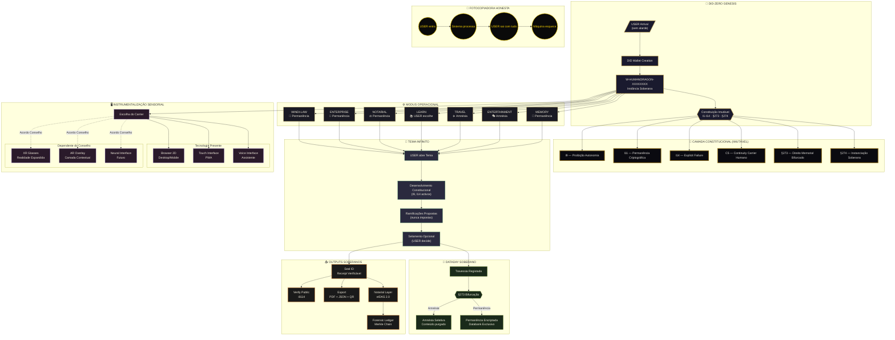

# WINDI-HIOS Production Flow Diagram
## Sessão 18 Mai 2026 — §273 + §274 SEALED



---

## Legenda

| Camada | Cor | Mutabilidade |
|--------|-----|--------------|
| **Genesis** | Ouro/Dourado | DID-zero único |
| **Constituição** | Noir profundo | **IMUTÁVEL** |
| **Modus** | Cinza-dourado | Seleccionável por sessão |
| **Tema Infinito** | Verde-floresta | Crescimento orgânico |
| **DataDay** | Verde-oliva | §273 bifurcação |
| **Sensorial** | Púrpura | Configurável / Conselho |
| **Output** | Cobre | Verificável publicamente |
| **Fotocopiadora** | Ouro brilhante | Máquina esquece |

---

## Fluxo Resumido

```
USER chega (sem alarde)
    │
    ▼
DID Wallet → W-HUMANDRAGON-XXXXXXXX
    │
    ▼
┌─────────────────────────────────────┐
│  CONSTITUIÇÃO IMUTÁVEL APLICADA     │
│  I9 · I11 · I14 · C5 · §273 · §274  │
└─────────────────────────────────────┘
    │
    ▼
MODUS OPERACIONAL (USER escolhe)
    │
    ├── LAW ────────► Permanência
    ├── ENTERPRISE ─► Permanência
    ├── NOTARIAL ───► Permanência
    ├── LEARN ──────► USER decide
    ├── TRAVEL ─────► Amnésia
    ├── ENTERTAINMENT► Amnésia
    └── MEMORY ─────► Permanência
    │
    ▼
TEMA INFINITO (desenvolvimento constitucional)
    │
    ▼
DATADAY SOBERANO
    │
    ├── Amnésia ────► Conteúdo purgado, Ledger intacto
    └── Permanência ► Databank Exclusivo do Carrier
    │
    ▼
INSTRUMENTALIZAÇÃO SENSORIAL
    │
    ├── Presente ───► Browser · Mobile · Voice
    └── Conselho ──► XR · AR · Neural (futuro)
    │
    ▼
OUTPUTS VERIFICÁVEIS
    │
    ├── Seal ID + Receipt
    ├── Verify Public (:8114)
    ├── Export (PDF + JSON + QR)
    ├── Notarial Layer (eIDAS 2.0)
    └── Forensic Ledger (Merkle)
    │
    ▼
┌─────────────────────────────────────┐
│     FOTOCOPIADORA HONESTA           │
│  USER sai com tudo · Máquina esquece│
└─────────────────────────────────────┘
```

---

## Receipts Desta Sessão

| § | Receipt | Commit |
|---|---------|--------|
| §273 | `WINDI-S273-...-3262DAA0` | `189cdf213` |
| §274 | `WINDI-S274-...-EF359603` | `e351988ec` |

---

*WINDI Publishing House · Kempten, Bavaria · 18 Mai 2026*
*"AI processes. Human decides. WINDI guarantees."*
