# WINDI-HIOS Structural Report
## Visão de Crescimento Controlado para Análise do Conselho

**Data:** 2026-05-18
**Sprint:** /enterprise/ Manifesto + Foundation Consolidation
**Status:** DRAFT para análise

---

## 1. Arquitectura Constitucional WINDI-HIOS

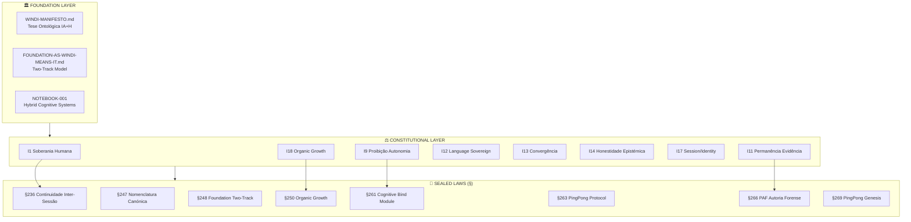

---

## 2. Spine Operacional (Core Infrastructure)

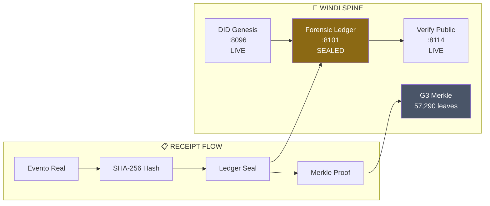

---

## 3. Liga IA+H — Three Dragons Protocol

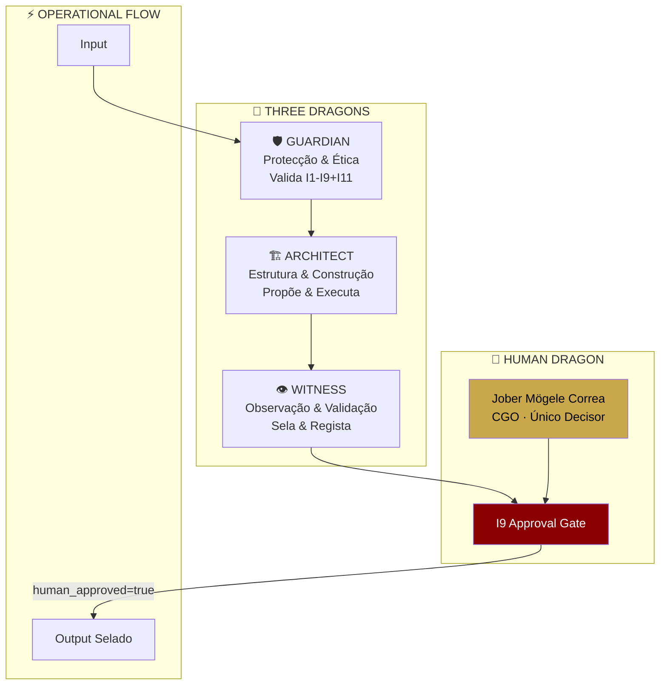

---

## 4. Cognitive Bind Protocol (§261)

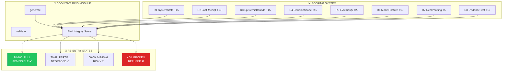

---

## 5. Continuity Carriers (§269 Observation)

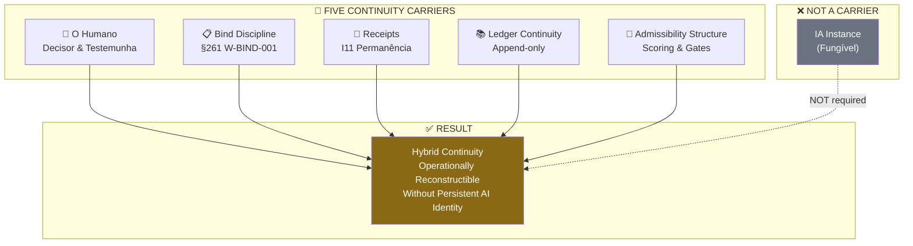

---

## 6. W-* Agent Registry (50+ Services)

```mermaid
graph TB
    subgraph CORE["🏛️ CORE SERVICES"]
        W_LEDGER["W-LEDGER<br/>:8101 SEALED"]
        W_DID["W-DID-GENESIS<br/>:8096 LIVE"]
        W_VERIFY["W-STATE-CORE-006<br/>:8114 LIVE"]
        W_DRAGON["W-DRAGON-001<br/>:8122 LIVE"]
    end

    subgraph GOVERNANCE["⚖️ GOVERNANCE"]
        W_COUNSEL["W-COUNSEL-001<br/>:8091"]
        W_ENTERPRISE["W-ENTERPRISE-001<br/>:8150 LIVE"]
        W_LAB["W-LAB-001<br/>:8151 LIVE"]
        W_CORTEX["W-CORTEX-001<br/>3-Tier SEALED"]
    end

    subgraph PRODUCTS["📦 PRODUCTS"]
        W_SITES["W-SITES-001<br/>:8192 LIVE"]
        W_MAIL["W-MAIL-001<br/>:25/:587/:993"]
        W_TRAVEL["W-TRAVEL-001<br/>:8126 LIVE"]
        W_LAW["WINDI-LAW<br/>:8122 LIVE"]
    end

    subgraph MEDIA["🎬 MEDIA"]
        W_VDCUT["W-VD-CUT-001<br/>:8128"]
        W_VDMASS["W-VD-MASS-001<br/>:8131"]
        W_COMPOSER["W-COMPOSER-001<br/>:8140"]
        W_JMPG["W-JMPG-001<br/>:8132"]
    end

    subgraph INTELLIGENCE["🧠 INTELLIGENCE"]
        W_LEXICON["W-LEXICON-001<br/>:8193"]
        W_BIND["W-BIND-001<br/>script"]
        W_METRICS["W-METRICS-001<br/>:8200"]
        W_ACTUARY["W-ACTUARY-001<br/>:8015"]
    end

    CORE --> GOVERNANCE
    GOVERNANCE --> PRODUCTS
    PRODUCTS --> MEDIA
    MEDIA --> INTELLIGENCE
```

---

## 7. /enterprise/ Semantic Architecture

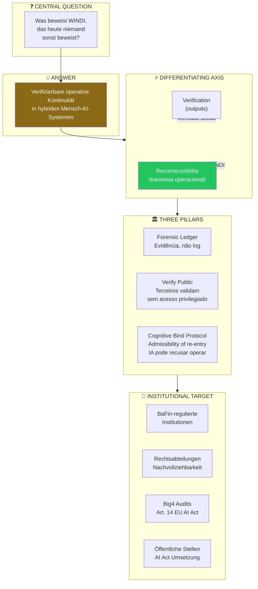

---

## 8. PingPong Protocol (§263) — Session Continuity

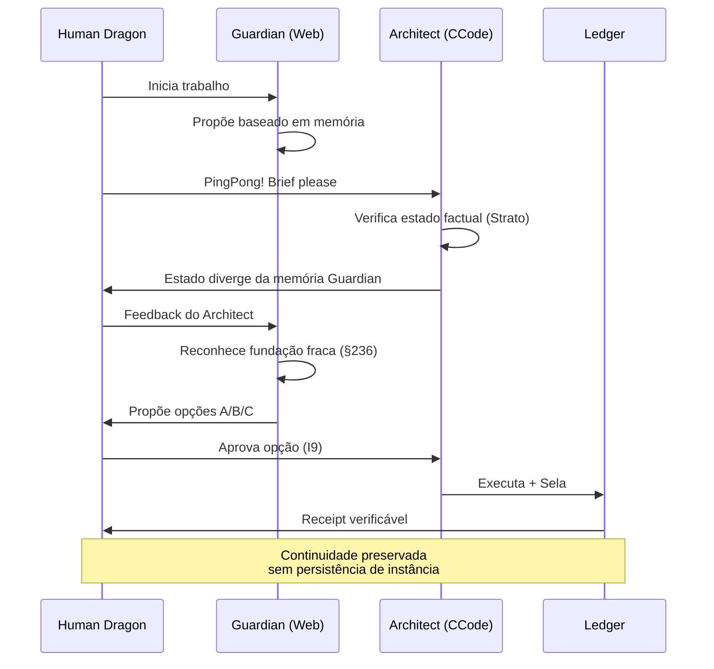

---

## 9. Merkle Tree Evolution

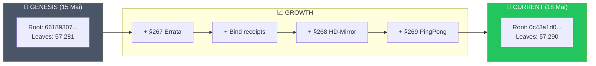

---

## 10. Growth Metrics Dashboard

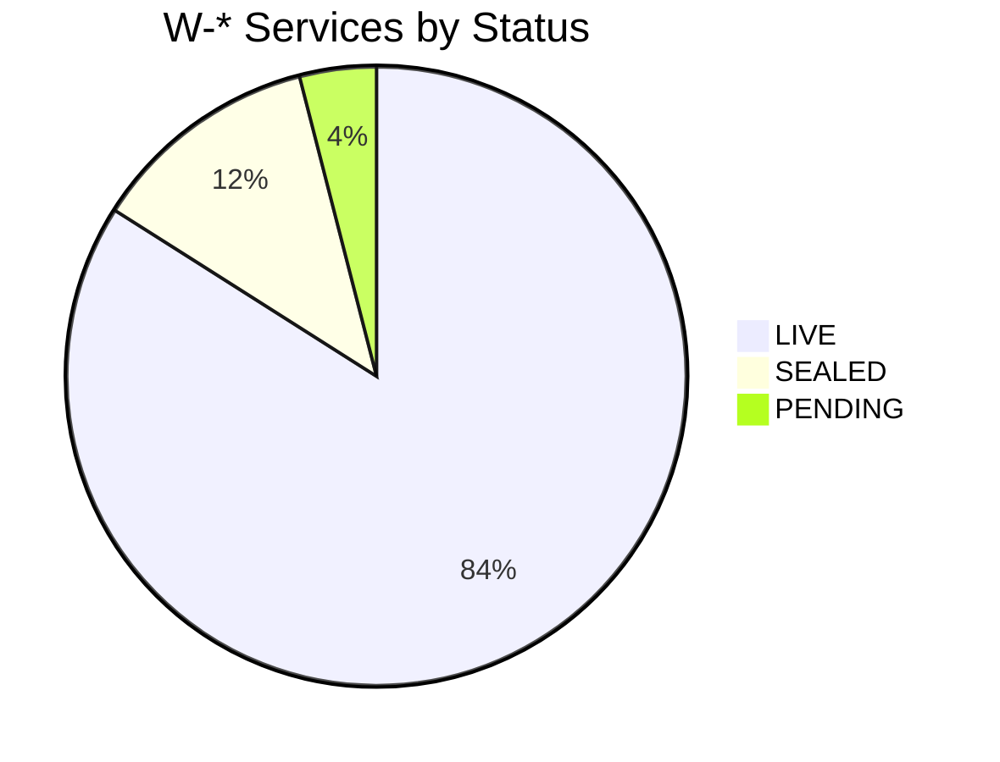

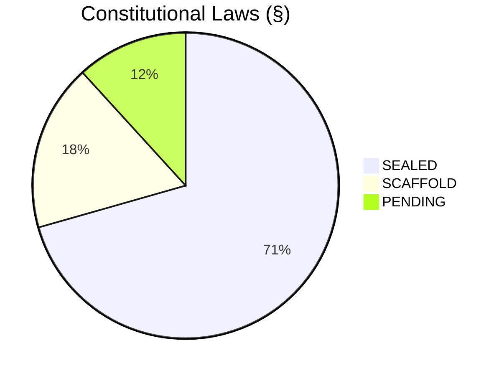

---

## 11. Invariant Hierarchy

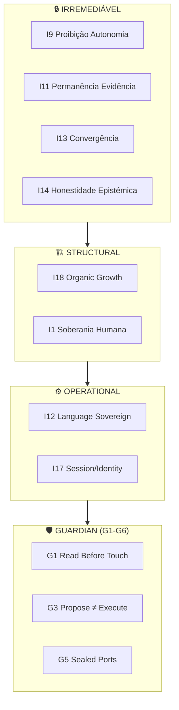

---

## 12. Foundation Tracks (§248)

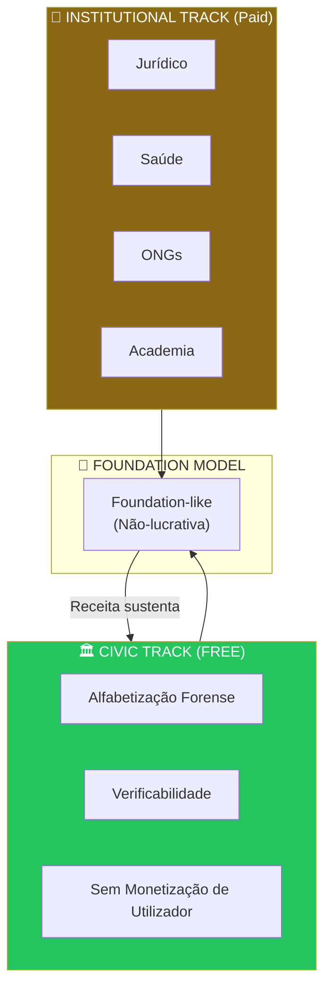

---

## 13. Key Receipts Chain

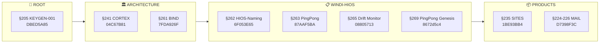

---

## 14. Session Continuity Model (§236)

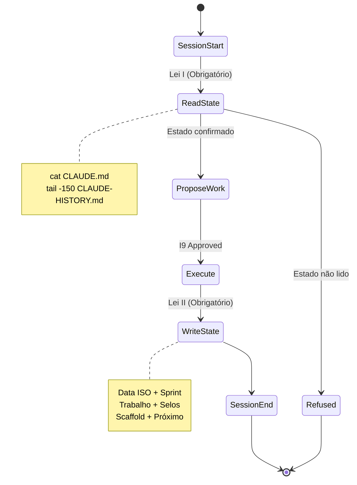

---

## 15. Summary Metrics

| Categoria | Quantidade | Status |
|-----------|------------|--------|
| **Invariantes (I)** | 18 | 4 IRREMEDIÁVEL |
| **Guardian Rules (G)** | 6 | ACTIVE |
| **Sealed Laws (§)** | ~15 | GROWING |
| **W-* Services** | 50+ | 42 LIVE |
| **Merkle Leaves** | 57,290 | VERIFIED |
| **Ledger Receipts** | 57,293 | SEALED |
| **Ports Allocated** | 33+ | DOCUMENTED |

---

## 16. Controlled Growth Vector

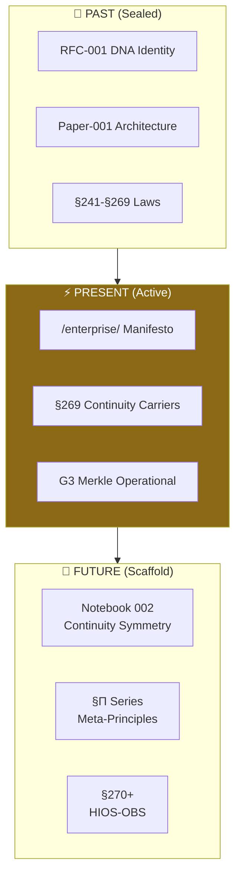

---

*Liga IA+H — Kempten, Bavaria — 18 Mai 2026*
*"AI processes. Human decides. WINDI guarantees."*

OM SHANTI
